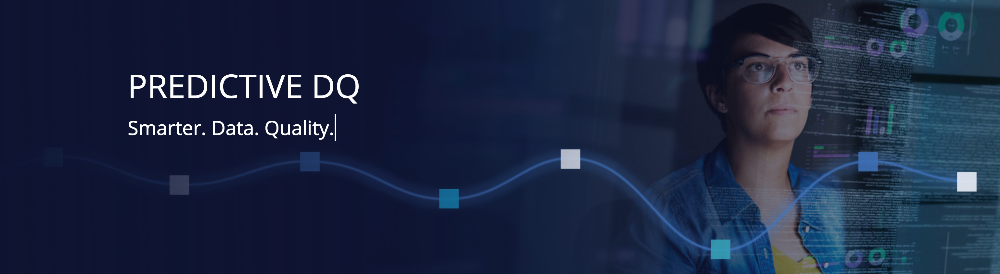

# OwlDQ

Automatic Data Quality without the need for Rules. Owl provides a fast and elegant way to manage your data sets by learning through observation rather than human input. Owl applies the latest advancements in Data Science and Machine Learning to the problem of Data Quality. Surfacing data issues in minutes instead of months.

## Getting Started with OwlDQ UI



## Deep Learning vs Machine Learning



## What Does DQ Mean to You?



### A Pluggable and Complete Data Quality Framework

If you are looking at adding data quality into your data pipelines the below visual might illustrate how many products and pieces you will need consider to successfully integrate into your overall governance program.  The OwlDQ suite allows you to pick and chose Owl components or integrate 3rd party components of your choice.  By using our best practice guide and framework you can complete the DQ lifecycle easily.

## Unify all datasources under 1 data quality program

