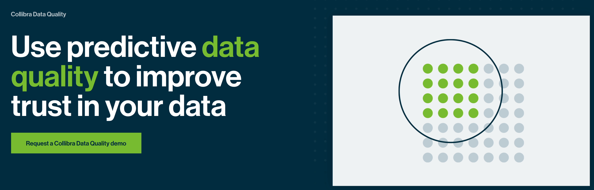
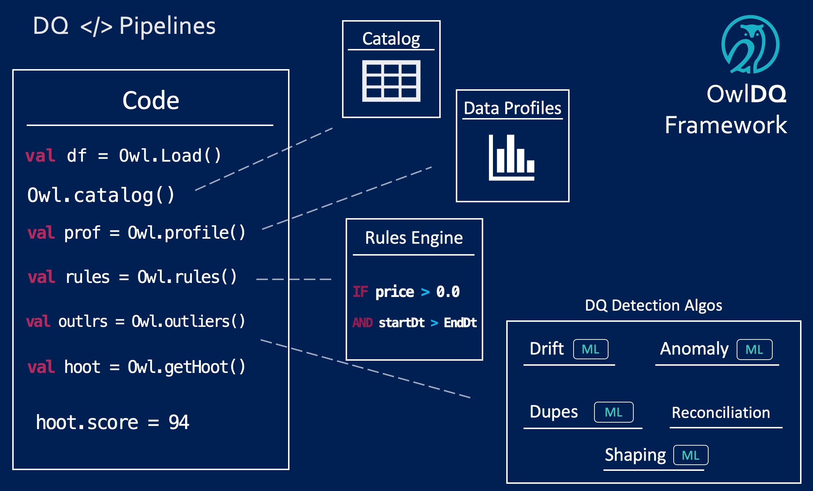

# Collibra Data Quality

Automatic Data Quality without the need for Rules. Owl provides a fast and elegant way to manage your data sets by learning through observation rather than human input. Owl applies the latest advancements in Data Science and Machine Learning to the problem of Data Quality. Surfacing data issues in minutes instead of months.

## Getting Started with Collibra DQ



## Deep Learning vs Machine Learning



## What Does DQ Mean to You?



### A Pluggable and Complete Data Quality Framework

If you are adding data quality to your data pipelines the below visual illustrates the number of products and pieces you will need consider to successfully complete your overall governance program.  The OwlDQ suite allows you to use either native Owl components or integrate the 3rd party components of your choice.  By using our best practice guide and framework you can complete the DQ lifecycle easily.

## Data Pipelines that Tie into the DQ Framework

Owl offers a coding framework for developers or ETL designers that want to built real-time data quality into their broader data pipeline.  This provides the same algos and DQ checks as the Owl UI Wizard but with direct access into your code points.  Consistency is a must to have a program you trust.   

