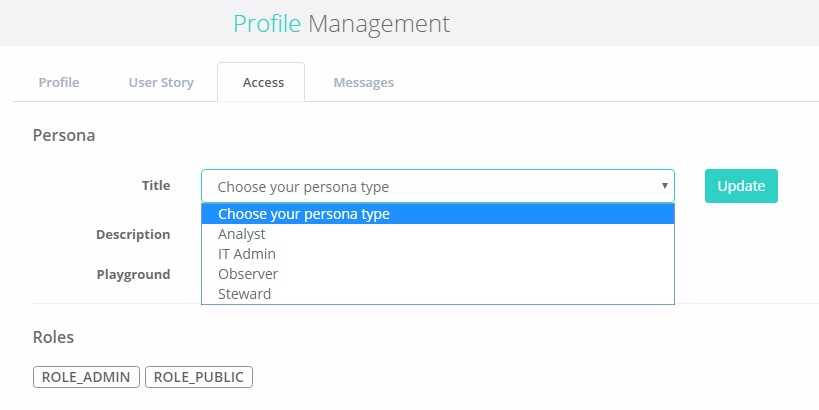

# Prescriptive Personas

Prescriptive Personas

Owl has 4 prescriptive personas to manage user permissions, Analyst, IT Admin, Observer, and Steward.  Simply click on the user icon located on the bottom left of the blue Owl Menu bar and select user profile.  The persona type can be assigned under the access tab in profile management.

