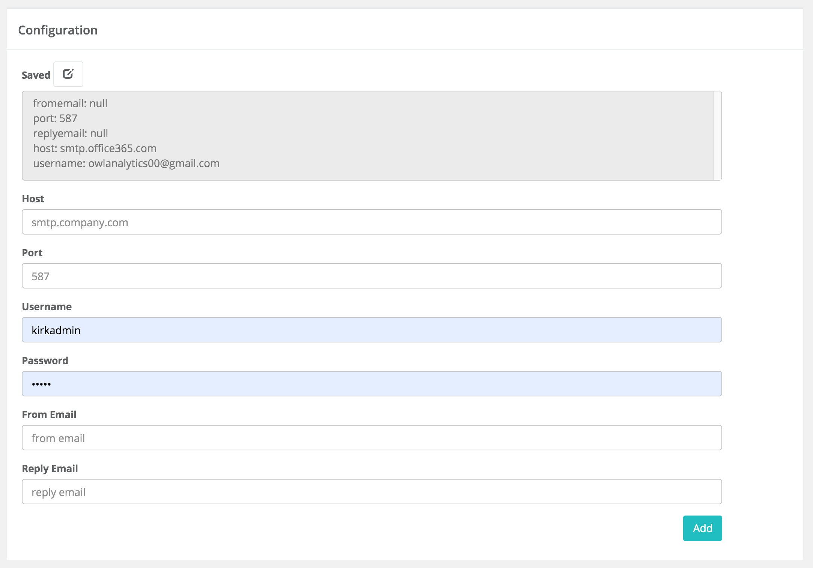
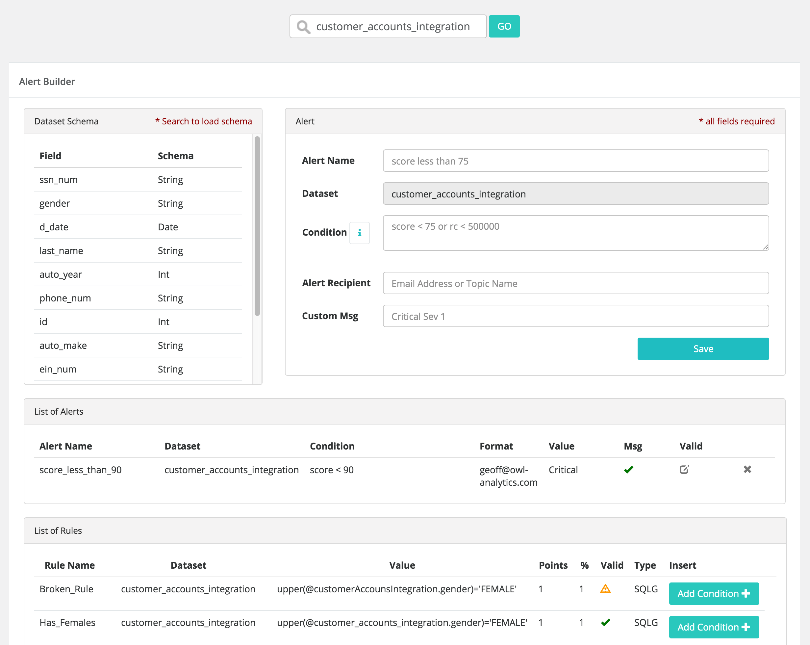

# Email Alerts

### Setting up the EmailServer Programmatically

If you are in a notebook or pipeline you may prefer to use the Scala/Spark API to create the Email Server 

```scala
    val emailServer = OwlUtils.createEmailServer("smtp-relay.sendinblue.com", 587)
    emailServer.setUsername("abc@owl-analytics.com")
    emailServer.setPassword("abc")
    emailServer.setCurrentSet(1)
    Util.EmailServerDaoFactory.delete(emailServer)
    Util.EmailServerDaoFactory.insert(emailServer)
```

### Setting up an Email Server using the WebApp



### Creating a Condition to Send an Alert

Also shows some of the common rules associated with this dataset for quick reference while creating.



### Example Alert in your Inbox


