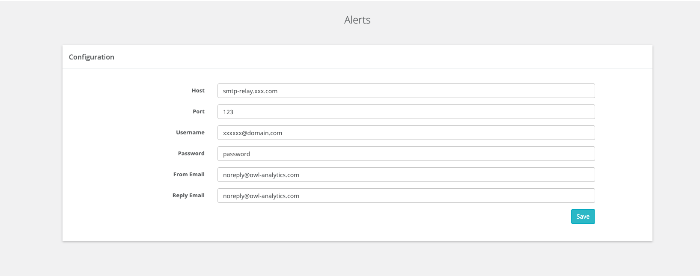
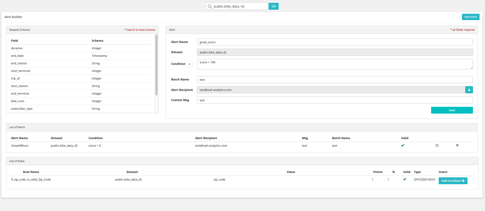
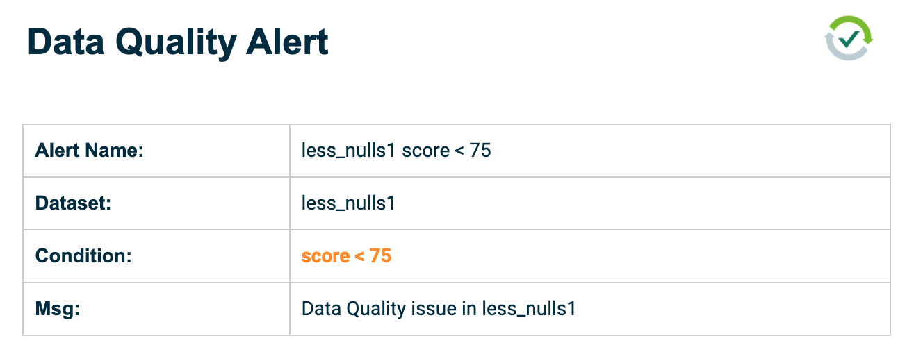
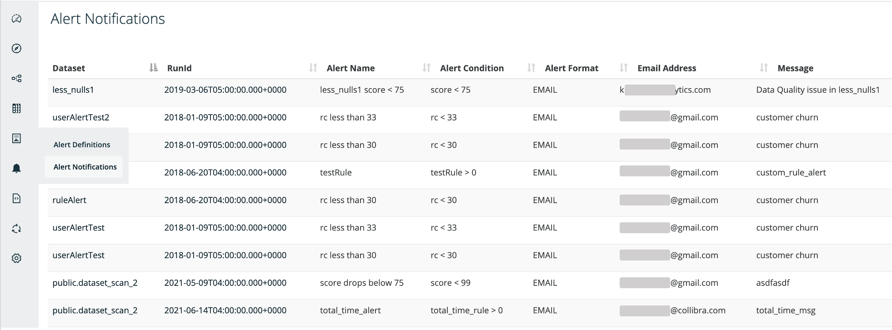

# Email Alerts

### Setting up the EmailServer Programmatically

If you are in a notebook or pipeline you may prefer to use the Scala/Spark API to create the Email Server 

```scala
    val emailServer = OwlUtils.createEmailServer("smtp-relay.sendinblue.com", 587)
    emailServer.setUsername("abc@owl-analytics.com")
    emailServer.setPassword("abc")
    emailServer.setCurrentSet(1)
    Util.EmailServerDaoFactory.delete(emailServer)
    Util.EmailServerDaoFactory.insert(emailServer)
```

### Setting up an Email Server using the WebApp

Navigate to OwlWeb URL.  Then click the gear icon on the left in the admin section and click alerts.



### Creating a Condition to Send an Alert

Also shows some of the common rules associated with this dataset for quick reference while creating. Use the batch name to create a consolidated list of alerts and distribution list for a set of notifications per dataset.



## DQ Alert in your Inbox

Below is what an alert email that makes it into your inbox will look like.  Always smart to make sure your email client didn't mark it as spam and that the SMTP was setup properly.  Some email clients automatically strip images therefore we try to keep the emails light on styling and straight to the point.



## Failed DQ Job Email Alert

There is also a scenario where the DQ job fails to run or has an exception and therefore never gets a chance to score the data or run the alert condition.  This is is a FAILED alert.


## Alert Notifications in Web UI

There are also alert notifications in the web UI.  This can be helpful to confirm that the email alerts were sent out and to whom should have received the notifications. 




