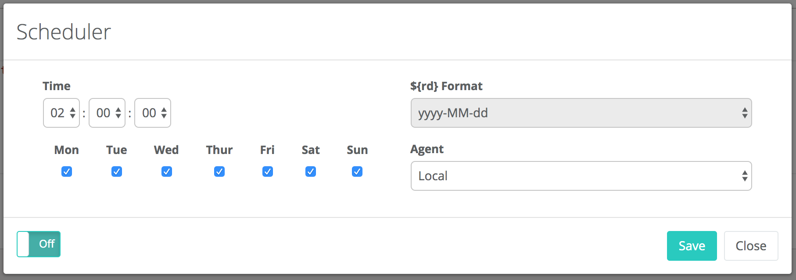
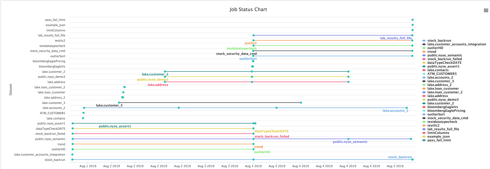

# Job Server

### Curl Example

```bash
curl -X POST --data '
{
"file": "/opt/owl/bin/owl-core-trunk-jar-with-dependencies.jar", 
"className": "com.owl.core.cli.Catalog", 
"args": 
    ["-cxn", "-databases", "public", "-driver", "org.postgresql.Driver", "-lib", "/opt/owl/drivers/postgres42/"]
}' 
-H "Content-Type: application/json" localhost:8998/batches
```

### Owl Job Dashboard


### Run Template

The most recommended way to run an Owl Check from outside the application is through the rest API detailed on the OwlCheck page using the link below.  The API is called RunTemplate



### Configure Multiple Clusters/Agents Per Tenant

Each tenant of Owl can connect and push processing to 1 or more clusters.  Owl is capable of pushing workloads to any of the registered environments \(Agents\) that it knows about. 

### Add an Agent/Cluster to a Tenant


### Owl Scheduler - Built In

A quick way to schedule jobs is to use Owl's one click scheduler.


### Job Scheduler



### Job Status Chart



### Job Scheduler View


