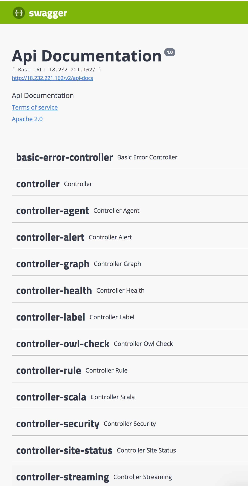
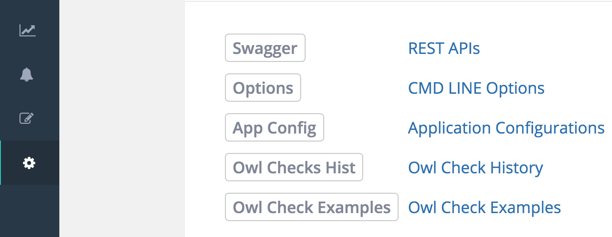

# Swagger

For example swagger API please visit - [https://app.swaggerhub.com/apis/drnice/Owl-1.2.0-RC2/1.0](https://app.swaggerhub.com/apis/drnice/Owl-1.2.0-RC2/1.0)

Owl software comes with full swagger support out of the box however integrating swagger into this documentation is a work in progress.  

```text
http://$owlhost/swagger-ui.html
```



### Owl's has docs built into the application




