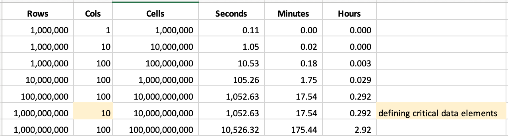

# Performance Tests

## Cells Per Second Performance Theory \(9.5M CPS\)



## Load and Profile

<table>
  <thead>
    <tr>
      <th style="text-align:left">
        <p>Dataset</p>
        <p>Name</p>
      </th>
      <th style="text-align:left">
        <p>GBs in</p>
        <p>Memory</p>
      </th>
      <th style="text-align:left">
        <p></p>
        <p>Rows</p>
      </th>
      <th style="text-align:left">
        <p></p>
        <p>Cols</p>
      </th>
      <th style="text-align:left">
        <p></p>
        <p>Cells</p>
      </th>
      <th style="text-align:left">
        <p>Num</p>
        <p>Execs</p>
      </th>
      <th style="text-align:left">
        <p>Num</p>
        <p>Cores</p>
      </th>
      <th style="text-align:left">
        <p>Exec</p>
        <p>Memory</p>
      </th>
      <th style="text-align:left">
        <p>Network</p>
        <p>Time</p>
      </th>
      <th style="text-align:left">
        <p>Total</p>
        <p>Time</p>
      </th>
    </tr>
  </thead>
  <tbody>
    <tr>
      <td style="text-align:left">NYSE</td>
      <td style="text-align:left">0.1G</td>
      <td style="text-align:left">103K</td>
      <td style="text-align:left">9</td>
      <td style="text-align:left">816K</td>
      <td style="text-align:left">1</td>
      <td style="text-align:left">1</td>
      <td style="text-align:left">1G</td>
      <td style="text-align:left">00:00:15</td>
      <td style="text-align:left">00:00:48</td>
    </tr>
    <tr>
      <td style="text-align:left">AUM</td>
      <td style="text-align:left">14G</td>
      <td style="text-align:left">9M</td>
      <td style="text-align:left">48</td>
      <td style="text-align:left">432M</td>
      <td style="text-align:left">5</td>
      <td style="text-align:left">1</td>
      <td style="text-align:left">4G</td>
      <td style="text-align:left">00:01:20</td>
      <td style="text-align:left">00:03:50</td>
    </tr>
    <tr>
      <td style="text-align:left">ENERGY</td>
      <td style="text-align:left">5G</td>
      <td style="text-align:left">43M</td>
      <td style="text-align:left">6</td>
      <td style="text-align:left">258M</td>
      <td style="text-align:left">8</td>
      <td style="text-align:left">3</td>
      <td style="text-align:left">3G</td>
      <td style="text-align:left">00:00:00</td>
      <td style="text-align:left">00:04:35</td>
    </tr>
    <tr>
      <td style="text-align:left">INVEST_DATA</td>
      <td style="text-align:left">20G</td>
      <td style="text-align:left">3.8M</td>
      <td style="text-align:left">158</td>
      <td style="text-align:left">590M</td>
      <td style="text-align:left">3</td>
      <td style="text-align:left">2</td>
      <td style="text-align:left">3G</td>
      <td style="text-align:left">00:00:40</td>
      <td style="text-align:left">00:03:32</td>
    </tr>
  </tbody>
</table>

### NYSE

Postgres database call, no concurrent processing, simple case, small data.

```bash
-bhtimeoff -numexecutors 1 
-lib "/opt/owl/drivers/postgres" 
-executormemory 1g 
-h metastore01.us-east1-b.c.owl-hadoop-cdh.internal:5432/dev?currentSchema=public 
-drivermemory 1g -master k8s:// -ds public.nyse_128 -deploymode cluster 
-q "select * from public.nyse" -bhlb 10 -rd "2020-10-26" 
-driver "org.postgresql.Driver" -bhminoff 
-loglevel INFO -cxn postgres-gcp -bhmaxoff
```

### AUM

Postgres database call uses parallel JDBC, split on aum\_id serial id.  

```bash
-owluser kirk 
-lib "/opt/owl/drivers/postgres" -datashapeoff 
-numpartitions 6 -ds public.aum_dt2_50 
-deploymode cluster -bhlb 10 -bhminoff 
-cxn postgres-gcp -bhmaxoff -bhtimeoff 
-numexecutors 6 
-executormemory 4g -semanticoff 
-h metastore01.us-east1-b.c.owl-hadoop-cdh.internal:5432/dev?currentSchema=public 
-columnname aum_id -corroff -drivermemory 4g -master k8s:// 
-q "select * from public.aum_dt2" -histoff -rd "2020-10-27" 
-driver "org.postgresql.Driver" -loglevel INFO -agentjobid 7664
```

### ENERGY

HDFS file with 43 million rows, converting a string date to date type, deploy mode client.

```bash
-f "hdfs:///demo/owl_usage_all.csv" \
-rd "2019-02-02" \
-ds energy_file \
-loglevel DEBUG -readonly \
-d "," -df dd-MMM-yy \
-master yarn \
-deploymode client  \
-numexecutors 3 \
-executormemory 10g
```

## Load Profile Outliers

### NYSE - 1:10 total runtime.  20 seconds for outliers

```bash
-bhtimeoff -owluser kirk -numexecutors 1 
-lib "/opt/owl/drivers/postgres" -executormemory 1g 
-dl -h metastore01.us-east1-b.c.owl-hadoop-cdh.internal:5432/dev?currentSchema=public 
-drivermemory 1g -master k8s:// -ds public.nyse_128 -deploymode cluster 
-q "select * from public.nyse" -bhlb 10 
-rd "2020-10-27" -driver "org.postgresql.Driver" 
-bhminoff -loglevel INFO -cxn postgres-gcp -bhmaxoff -agentjobid 7721 
```

