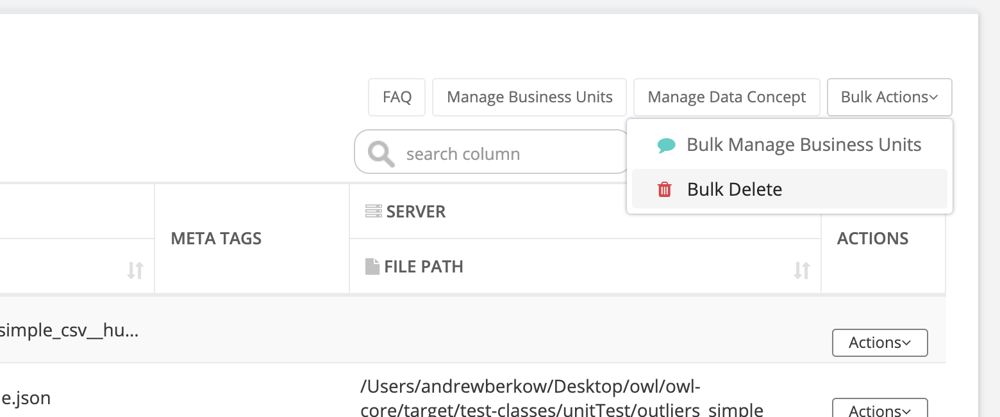
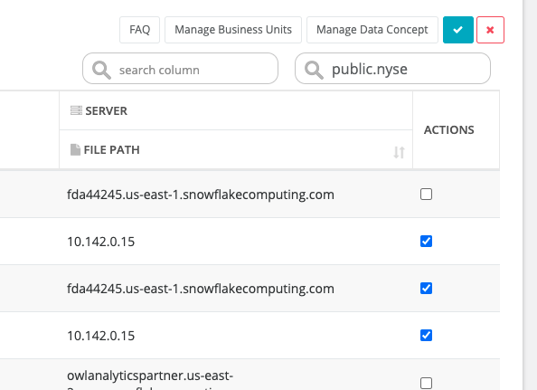
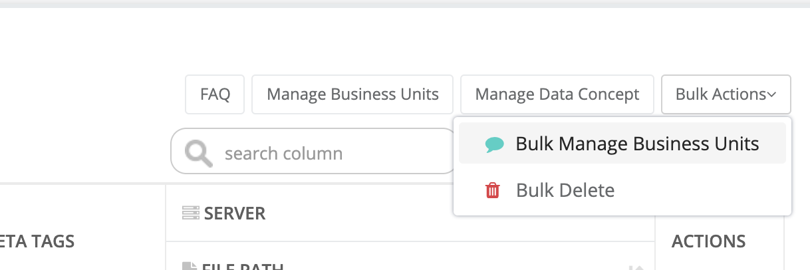
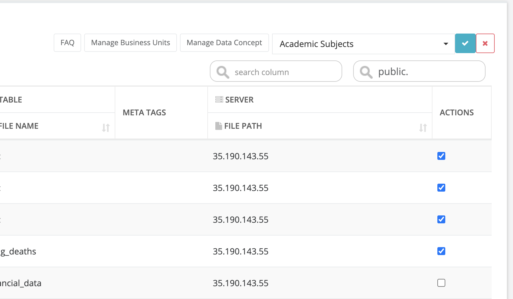
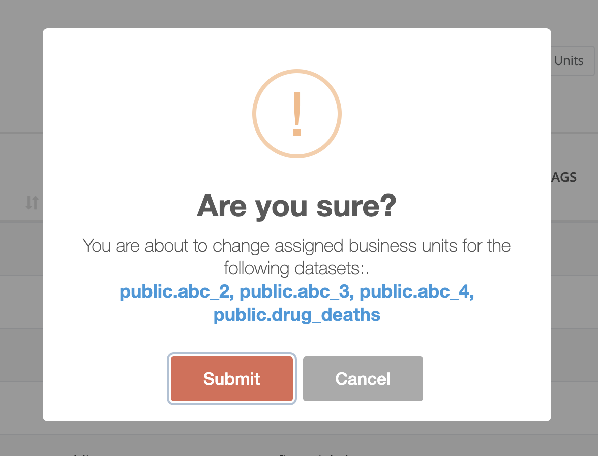

# Catalog Bulk Actions

### Bulk Delete

The catalog allows user to delete multiple datasets in one action through the catalog. Click the Bulk Actions button dropdown in the top right corner. Select Bulk Delete.

Each data set row will now have a checkbox in the Actions column. All filters can be applied now and the user can check all data sets they wish to delete. Once desired datasets are selected, the checkbox can be clicked. The user will be prompted to confirm they wish to delete datasets. The user can also click the X button to cancel.

### Bulk Manage Business Units

Another bulk feature allows the user to manage the assigned business unit to multiple datasets. Click the Bulk Actions button dropdown in the top right corner. Select Bulk Manage Business Units.

Each data set row will now have a checkbox in the Actions column. All filters can be applied now and the user can check all data sets they wish to delete. Once desired datasets are selected, the user can select a business unit from the business unit dropdown control in the top right corner and click the checkbox. The user will be prompted to confirm they wish to change the assigned business unit to the datasets.

