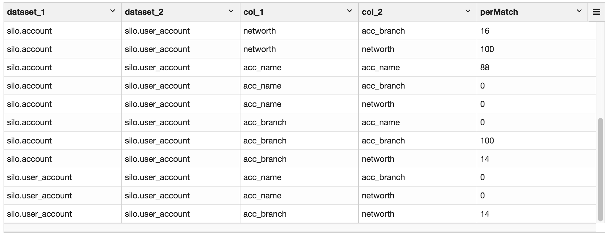
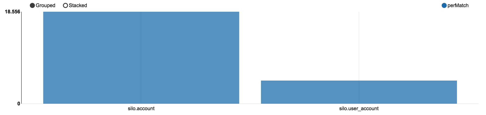

# Cluster Health Report

### Reclaim Gigabytes of Redundant Data

As data engineers, first we copy files into a landing zone, next we load the files into a staging area.  After that we transform \(ETL\) the data into the final table.  Soon that same data is copied to a lake for other groups to run analytics on.  Eventually a group of analysts will need the data in another format and a data engineer will copy the data in a newly joined or transposed fashion.  Sounds familiar?

The result is the same data or similar columns of the same data being copied many times.  **The answer**:  _Buy more hardware_... could be  OR   _run an Owl health report_ and gain an understanding of how much data could be removed, reclaiming disk space and instantly seeing a return on investment after clicking the button.

### Tabular breakdown of % fingerprint match



Sometimes its not as simple as comparing 2 tables from the same database.  Owl allows a technical user to setup multiple DB connections before executing an owl health check.

```text
import com.owl.common.Props
import com.owl.core.Owl

val c1 = new Connection()
c1.dataset = "silo.account"
c1.user = "user"
c1.password = "pass"
c1.query = "select id, networth, acc_name, acc_branch from silo.account limit 200000"
c1.url = "jdbc:mysql://owldatalake.chzid9w0hpyi.us-east-1.rds.amazonaws.com:3306"

val c2 = new Connection()
c2.dataset = "silo.user_account"
c2.user = "user"
c2.password = "pass"
c2.query = "SELECT acc_name, acc_branch, networth FROM silo.account limit 200000"
c2.url = "jdbc:mysql://owldatalake.chzid9w0hpyi.us-east-1.rds.amazonaws.com:3306"

val props = new Props()
props.dataset = "colMatchTest1"
props.runId = "2017-02-04"
props.connectionList = List(c1,c2).asJava
props.colMatchBatchSize = 2
props.colMatchDurationMins = 3

val matchDF = new Owl(props).colMatchDF
matchDF.show

matchDF.createOrReplaceTempView("matches")
```

### High level view of data overlap



  

