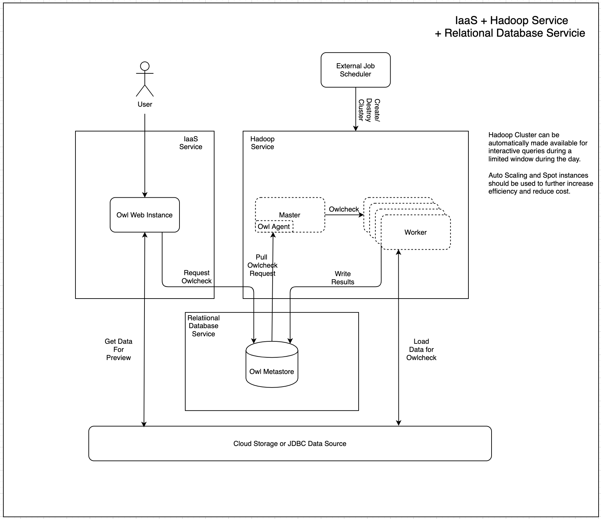
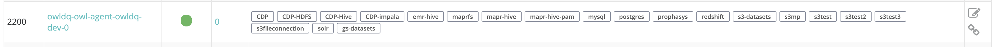
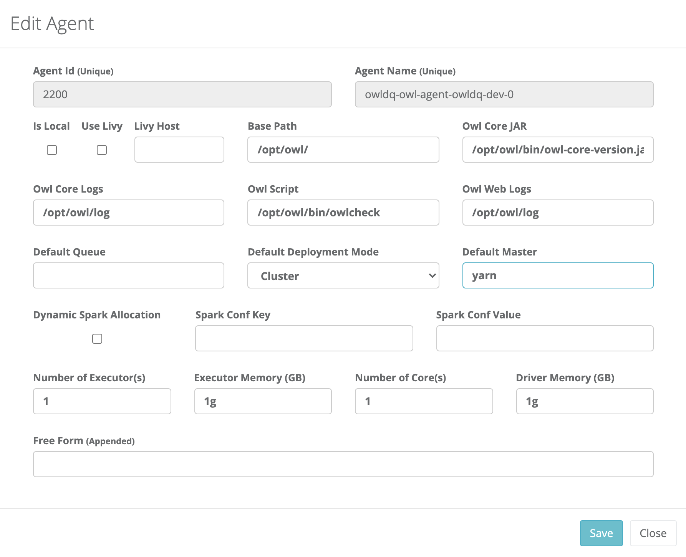
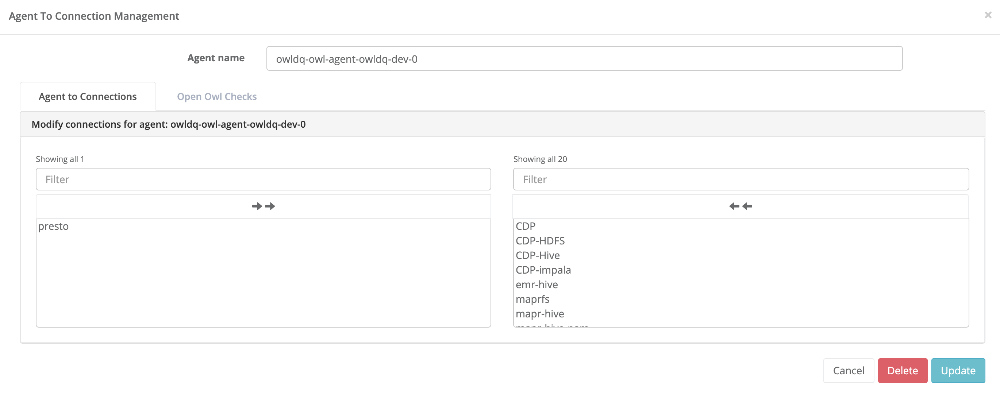

# EMR / Dataproc / HDI

Running Apache Spark on Kubernetes differs from running this on virtual machine-based Hadoop clusters, which is the current mechanism provided by the existing CloudProc Dataproc service or competitive offerings like Amazon Web Services \(AWS\) Elastic MapReduce \(EMR\) and Microsoft's Azure HDInsight \(HDI\).

Each cloud provider will have unique steps and configuration options. More detail on enabling agents for this deployment option be found in the [Hadoop Integration](https://docs.owl-analytics.com/installation/hadoop-integration) section.

A detailed guide for EMR is provided below.

## OwlDQ on EMR Architecture

OwlDQ is able to use EMR as the compute space for data quality jobs \(Owlchecks\). While it is possible to simply operate a long running EMR cluster, EMR's intended operation model is ephemeral infrastructure. Using EMR as an ephemeral compute space is the most cost effective approach both in terms of operational effort and infrastructure costs. OwlDQ makes it possible to seamlessly leverage EMR in this operating model. When there is not an EMR cluster available, OwlDQ users are still able to browse datasets and DQ results in Web. However, if a user attempts to deploy an Owlcheck, they will simply see a red light icon next to the target agent. If the user still wants to request an Owlcheck, it will simply wait in queue until the target agent comes back online the next time an EMR cluster is available.



### Prepare for Deployment


Before enabling OwlDQ to use EMR as the compute space, make sure that Owl Web and the Owl Metastore are already deployed \([https://docs.owl-analytics.com/installation/full-install](https://docs.owl-analytics.com/installation/full-install)\). 


1. Create a "bootstrap bucket" location in S3 where OwlDQ binaries and bootstrap script \(install-agent-emr.sh\) will be staged. The EMR cluster instances will need to include an attached Role that has access to this location in order to bootstrap the cluster. This location should not contain any data or any kind of sensitive materials and thus should not require any special permissions. It just needs to be accessible by EMR clusters for bootstrap purposes. 
2. Create or modify an instance Profile Role that will be attached to EMR clusters so that it enables read access to the bootstrap bucket location. This Role is separate from the EMR service role that EMR will use to deploy the infrastructure.
3. Stage the bootstrap script and the OwlDQ binary package in the bootstrap location created above.
4. Make sure that the VPC where the Owl Metastore is deployed is accessible from the VPC where EMR clusters will be deployed.
5. Make sure that Security Groups applied to the Owl Metastore are configured to allow access from EMR master and worker Security Groups.
6. Decide whether to use EMR 5.x or EMR 6.x. This is important because EMR 6 introduces Spark 3 and Scala 2.12. If EMR 6 is chosen, make sure OwlDQ binaries were compiled for Spark 3 and Scala 2.12.
7. \(OPTIONAL\) Create and store a private key to access EMR instances

### Deploy EMR Cluster

There are several ways to deploy EMR, however, for dev-ops purposes, the simplest path is usually to use the AWS CLI utility. The example below will deploy and EMR cluster bootstrapped with OwlDQ binaries and a functioning agent to deploy Owlchecks. 


When defining the Bootstrap Location argument, do not include "s3://". For example:

If Bootstrap Location is s3://bucket/prefix then BOOTSTRAP\_LOCATION="bucket/prefix"


```
aws emr create-cluster \
--auto-scaling-role EMR_AutoScaling_DefaultRole \
--applications Name=Hadoop Name=Spark Name=Hive Name=Tez \
--name owl-emr \
--release-label emr-6.2.0 \
--region ${EMR_REGION} \
--ebs-root-volume-size 10 \
--scale-down-behavior TERMINATE_AT_TASK_COMPLETION \
--enable-debugging \
--bootstrap-actions \
"[{\"Path\":\"s3://${BOOTSTRAP_LOCATION}/install-agent-emr.sh\", \
\"Args\":[ \
\"${OWL_VERSION}\", \
\"${OWL_AGENT_ID}\", \
\"${METASTORE_HOST}:${METASTORE_PORT}/${METASTORE_DB}?currentSchema=owlhub\", \
\"${METASTORE_USER}\", \
\"${METASTORE_PASSWORD}\", \
\"${BOOTSTRAP_LOCATION}\", \
\"${LICENSE_KEY}\", \
\"native\"], \"Name\":\"install-owl-agent\"}]" \
--ec2-attributes "{ \
\"KeyName\":\"${EMR_INSTANCE_PRIVATE_KEY_NAME}\", \
\"InstanceProfile\":\"${BOOTSTRAP_ACCESS_ROLE}\", \
\"SubnetId\":\"${EMR_SUBNET}\", \
\"EmrManagedSlaveSecurityGroup\":\"${EMR_WORKER_SECURITY_GROUP}\", \
\"EmrManagedMasterSecurityGroup\":\"${EMR_WORKER_SECURITY_GROUP}\" \
}" \
--service-role ${EMR_SERVICE_ROLE} \
--log-uri s3n://${EMR_LOG_LOCATION} \
--instance-groups "[ \
{\"InstanceCount\":1,\"InstanceGroupType\":\"MASTER\",\"InstanceType\":\"${EMR_MASTER_INSTANCE_TYPE}\",\"Name\":\"Master - 1\"}, \
{\"InstanceCount\":3,\"InstanceGroupType\":\"CORE\",\"InstanceType\":\"${EMR_CORE_INSTANCE_TYPE}\",\"Name\":\"Core - 2\"} \
]" 
```

### Configure Agent

Once the EMR cluster and Owl Agent is deployed, it needs to be configured in Owl Web. 

1. Log into Owl Web, click the gear icon in the Navigation Pane and select "Admin Console".
2. In the Admin Console, click on the "Remote Agent" tile.
3. The newly created agent should have a green light icon.



Click the Pen/Pencil icon to the far right to configure the agent's settings. Make sure that Deploy Mode is set to "Cluster" and Default Master is set to "yarn".



Click the chain link icon to the far right to configure what datasources the agent is able to deploy Owlchecks for.



Any datasources that are not listed in the right hand pane will not be visible to this agent.

### Run Owlchecks

Everything is now ready for users to use EMR to run Owlchecks on data. Review Explorer2 documentation \([https://docs.owl-analytics.com/dq-visuals/explorer-2](https://docs.owl-analytics.com/dq-visuals/explorer-2)\) for detailed instructions.

