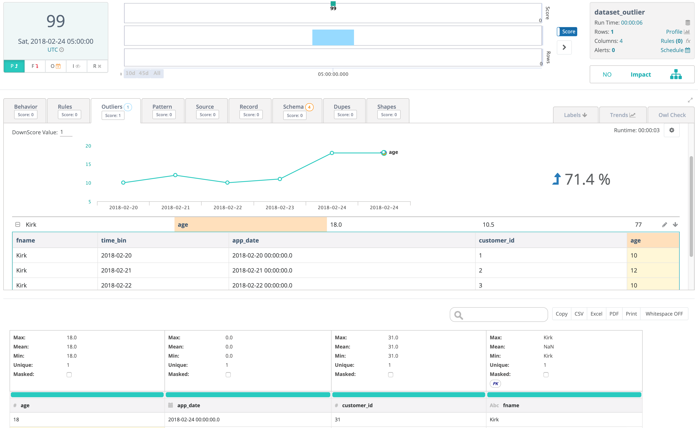

# Notebook Outlier Example

This real life use-case is when you have a large file or data frame with many days of data but you want the run profile to be the current day so that it trends properly overtime.  Another nuance to this use-case is that the customer\_id is a unique field to the user and it should not show up in the analytics i.e. an outlier.  But the customer\_id should be available when the user wants to query the rest api end points.  The customer\_id is then used to link back the users original dataset.  A bloomberg\_Id \(BB\_ID\) is a common example.

### CSV File

```text
fname,app_date,age,customer_id
Kirk,2018-02-24,18,31
Kirk,2018-02-23,11,4
Kirk,2018-02-22,10,3
Kirk,2018-02-21,12,2
Kirk,2018-02-20,10,1
```

### Notebook Code \(Spark Scala\)

```scala
val filePath = getClass.getResource("/notebooktest.csv").getPath

val spark = SparkSession.builder
  .master("local")
  .appName("test")
  .getOrCreate()

val opt = new OwlOptions()
opt.dataset = "dataset_outlier"
opt.runId = "2018-02-24"
opt.outlier.on = true
opt.outlier.key = Array("fname")
opt.outlier.dateColumn = "app_date"
opt.outlier.timeBin = OutlierOpt.TimeBin.DAY
opt.outlier.lookback = 5
opt.outlier.excludes = Array("customer_id")

val dfHist = OwlUtils.load(filePath = filePath, delim = ",", sparkSession = spark)
val dfCurrent = dfHist.where(s"app_date = '${opt.runId}' ")

val owl = OwlUtils.OwlContextWithHistory(dfCurrent=dfCurrent, dfHist=dfHist, opt=opt)
owl.register(opt)
owl.owlCheck()
```

### Owl Web UI

Score drops from 100 to 99 based on the single outlier in the file. Row count is 1 because there is only 1 row in the current data frame.  The historical data frame was provided for context and you can see those rows in the outlier drill-in.  The customer\_id is available in the data preview and can be used as an API hook to link back to the original dataset.  



After you run an owlcheck using owl.owlcheck you might want to check individual scores to see what type of issues were in the data.  Owl can send back the records with issues in the format of a DataFrame using the notebook cmds or JSON from the REST api.  

```scala
val hoot = owl.hoot

println(s"SHAPE   ${hoot.shapeScore} ")
println(s"DUPE    ${hoot.dupeScore} ")
println(s"OUTLIER ${hoot.outlierScore} ")
println(s"PATTERN ${hoot.patternScore} ")
println(s"RECORD  ${hoot.recordScore} ")
println(s"SCHEMA  ${hoot.schemaScore} ")
println(s"BEHAVIOR${hoot.behaviorScore} ")
println(s"SOURCE  ${hoot.sourceScore} ")
println(s"RULES   ${hoot.ruleScore} ")

if (hoot.shapeScore > 0) {
  owl.getShapeRecords.show
}
if (hoot.dupeScore > 0) {
  owl.getDupeRecords.show
}
```

```text
+-------+---------+--------------------+--------+-----------+-------+------+
|row_cnt|obs_score|             row_key|obs_type|customer_id|  fname|owl_id|
+-------+---------+--------------------+--------+-----------+-------+------+
|     21|       46|afa89984ce472a409...|    DUPE|         32|   Kirk|     1|
|     22|       46|afa89984ce472a409...|    DUPE|         31|Kirk's.|     2|
|     23|       60|41ea2d828b1a5fbf2...|    DUPE|         30|    Dan|     3|
|     24|       60|41ea2d828b1a5fbf2...|    DUPE|         27|    Dan|     6|
```

```text
+---------------+--------------------+--------+----------+--------------+--------+-------+-------+---+--------------------+-----------+-------+------+--------+
|        dataset|              run_id|col_name|col_format|col_format_cnt|owl_rank|row_cnt|row_key|age|            app_date|customer_id|  fname|owl_id|time_bin|
+---------------+--------------------+--------+----------+--------------+--------+-------+-------+---+--------------------+-----------+-------+------+--------+
|dataset_outlier|2018-02-24 00:00:...|   fname|   xxxx'x.|             1|       1|      2|xxxx'x.| 18|2018-02-24 00:00:...|         31|Kirk's.|     2|    null|
+---------------+--------------------+--------+----------+--------------+--------+-------+-------+---+--------------------+-----------+-------+------+--------+
```



GetOutlier










name of dataset



yyyy-MM-dd format can include time and timezone










```bash
{
  confidence: 77
  dataset: "dataset_outlier"
  keyArr: null
  lb: 0
  outColumn: "age"
  outKey: "Kirk"
  outMedian: "10.5"
  outValue: "18.0"
  runId: "2018-02-24T05:00:00.000+0000"
  ub: 0
}
```







GetShape










name of dataset



yyyy-MM-dd format can include time and timezone










```

```





