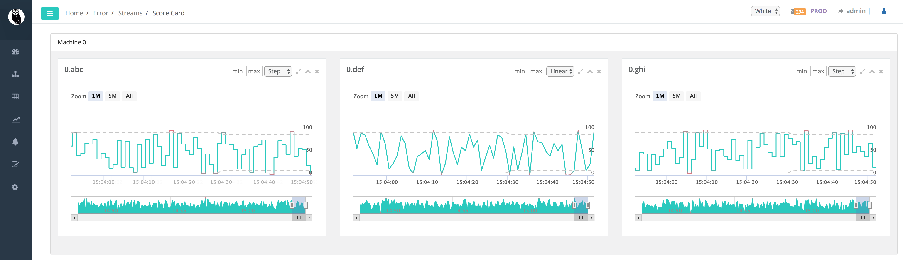
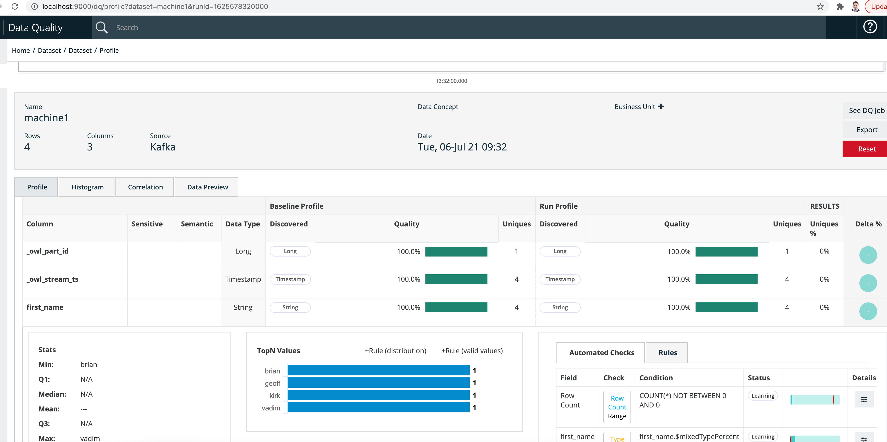

# DQ Job Kafka

### Kafka Requires Zookeeper

Apache Kafka typically requires zookeeper.  This file and cmd can be run from inside /kafka/bin 

```python
# Start the ZooKeeper service
# Note: Soon, ZooKeeper will no longer be required by Apache Kafka.
$ bin/zookeeper-server-start.sh config/zookeeper.properties
```

### Start a Kafka Server

Precursor step to Owl \(you likely already have this step completed if you use Kafka\)

```scala
bin/kafka-server-start.sh config/server.properties
```

### Start a Kafka Topic

Precursor step to Owl \(you likely already have this step completed if you use Kafka\)

```python
bin/kafka-topics.sh --create --bootstrap-server localhost:9092 --replication-factor 1 --partitions 1 --topic test

# prefered cmd is below
bin/kafka-topics.sh --create --zookeeper localhost:2181 --replication-factor 1 --partitions 1 --topic test
```

### Put a msg on "test" Topic

```scala
bin/kafka-console-producer.sh --broker-list localhost:9092 --topic test
```

### Kafka Consumer or Owl Consumer

Kafka works as a topic so you can have many consumers.  Here is a basic cmdline consumer but we can add Owl as a second consumer.

```scala
bin/kafka-console-consumer.sh --bootstrap-server localhost:9092 --topic test --from-beginning
```

```scala
/opt/owl/bin/owlcheck.sh       
      -kafkatopic test
      -ds machine1
      -streamformat csv 
      -kafkaport  9092 
      -kafkabroker localhost
      -streaminterval 60
      -stream -kafka 
      -header  first_name
      -master local
```





### Streams vs Sensors

Technically speaking anything moving in real-time is a stream of data but Owl classifies streams and IoT sensors as slightly different for the following reasons:

#### Sensors

Sensors are commonly a standard time-series. Signal, Time, Value

| Signal | Time | Value |
| :--- | :--- | :--- |
| device1-CPU | 2019-02-11 13:40:55 | 4 |
| device1-CPU | 2019-02-11 14:33:20 | 2 |

#### Streams

Streams commonly look like messages, jsons, avro or batch data but constantly flowing.  Another way to think of it is a multiple time-series

```text
[
    trade: {
        price: 23.75,
        qty: 20,
        symbol: HDP
    },
        trade: {
    }
]
```

| fname | age | networth | email |
| :--- | :--- | :--- | :--- |
| Joe | 45 | $130,000 | joe@yahoo.com |
| Mark | 33 | $125,000 | mark@yahoo.com |

The difference between a Sensor and a Stream in the above example is that in the case of the sensor the user is primarily concerned with the actual value of the "Value".  Meaning a spike in temperature or a drop in CPUs.  But in a stream of customer data there isn't a time "X" and value "Y" there are many values "Y" and you a user is interested in the overall quality of both the entire stream and the individual values.  Relationship analysis and other correlative functions apply here.  If you were to chart a "stream" what would you chart?  The row count volume or just one of the columns or the count of something?  But if you were to chart a sensor you know exactly what you would chart... the "Value" over "Time".  

Fortunately Owl has already thought and worked through the many nuances required to understand, monitor and predict accurately for all of these use-case.  All that is required is to subscribe the stream. 

