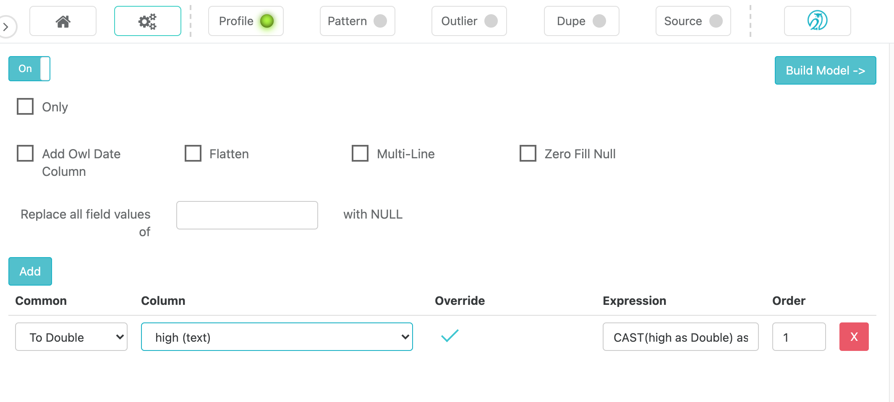

# OwlCheck Transform

### Transform Date

During DQ setup you can transform columns such as Dates and Numbers to preferred formats.   It is a common need to replace N.A. with nulls or empty white space.  

