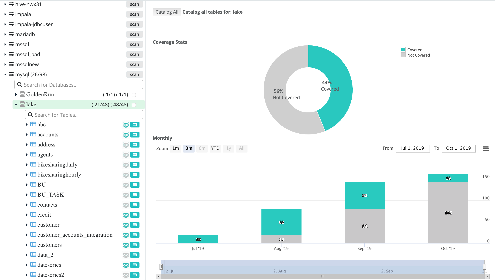
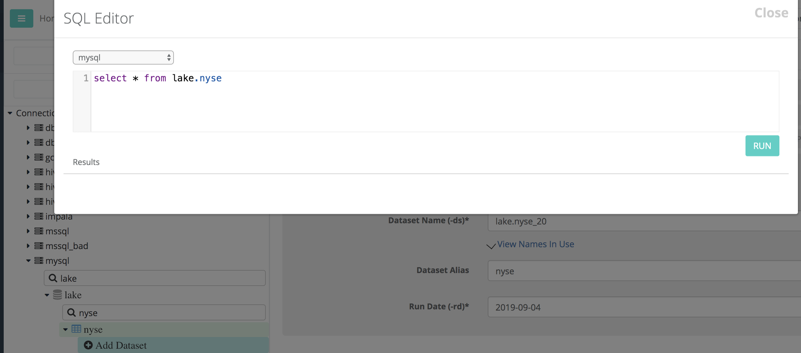

# Explorer

## Explore Database Connections and File systems

Use the explorer tab to quickly see which tables are cataloged with Owl \(the square catalog icon\) and which have Owl's quality protection \(the owl icon\).

Below you will see 48/48 database tables have been cataloged with Owl but only 21/48 have an owlcheck. This means that this particular database schema is 44% protected from future DQ issues.

## DQ coverage over time

As you add more datasets to Owl, you will see your bar chart increase over time and the donut chart fill in with more coverage.

## Job Estimator

Before firing off a large ML job it can be helpful to understand the amount of cores and ram that the job requires to run efficiently. Right sizing jobs is often the best way to get the best performance out of each run. Click the \[Auto Estimate\] button for quick stats for both sizing and estimated runtime information.

### Dynamic allocation

Many clusters offer the ability to scale up and down job containers. If Dynamic Allocation is turned on you may not need or desire Owl's recommended `num-executors` or `executor-memory`. However, in our testing right sizing the job before executing is both faster and a healthy habit. Faster, because there is less orchestration and context switching while the job is doing work; we've minimized time spent running out of space and having to reallocate and shuffle to a new container. Healthier, because it give the user real-time feedback on the cost of each feature and the ability to control the cost benefit analysis.

## SQL Editor

Automatically tracks to the connection, database and table in the explorer and provides a quick way to ask the database simple questions like, counts, groupings and specific clauses.

