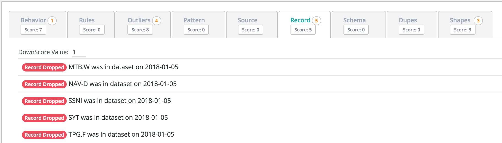

# Missing Records

## Where'd my rows go?

Owl is constantly learning which records or rows in a dataset are most common. In the case below the NYSE had a reasonable dataset volume \(row count\).

## Row Count Trend

We can see the rows dipping just slightly outside their predicted range. Arguably a subtle drop, yet abnormal to not represent these companies that typically do trade on the NYSE. Were they de-listed?

