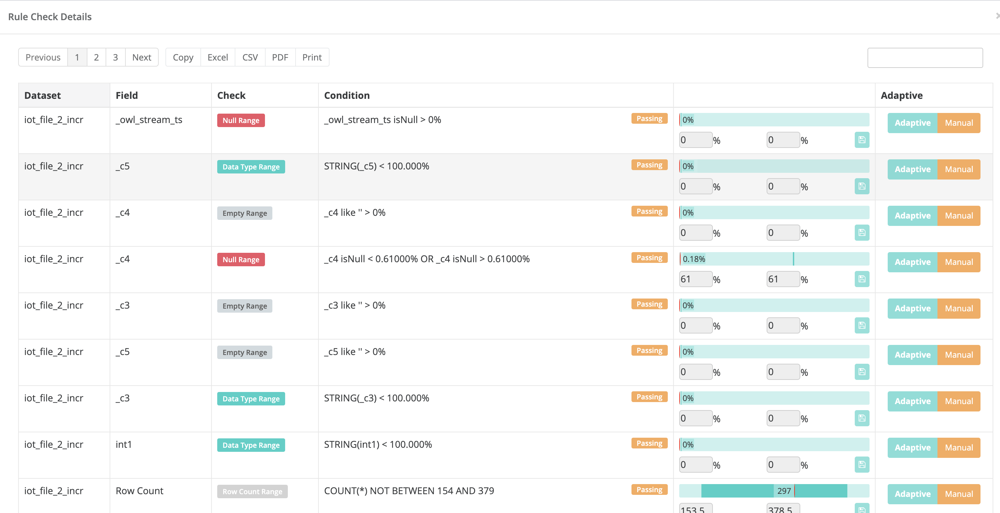

# Behaviors

## Evolution of Rule based Data Quality

The main goal of OwlDQ is to provide enterprise data quality insight while greatly reducing the volume of Rules that need to be written manually. When a dataset is brought under management, Owl profiles the data and builds a model for each dataset. This allows Owl to learn what "normal" means within the context of each dataset. As the data changes, the definition of "normal" will change as well. Instead of requiring the user to adjust rule settings, Owl continues to adjust its model. This approach enable Owl to provide automated, enterprise grade DQ coverage that removes the need to write dozens or even hundreds of rules per dataset.

## Training Behavioral Model

Typically, data quality checks \(Owlcheck\) is scheduled to run on a given dataset daily. With each run, Owl will profile the dataset at the column level and begin to establish a model for the dataset. Initially, there is no need for any manual intervention, just keep the data coming. Within a few runs, the model will become sufficiently robust to begin detecting data quality issues that would otherwise be covered by manual rules. For example, Owl may detect that particular column experienced a spike in the number of NULL values \(typical manually defined rule\). 


 Owl's behavioral model consist of the following factors:

* NULL values
* Empty values
* Cardinality
* Datatype shifting
* Row counts
* Load time


Over time, the definition of normal for any given column within the dataset can change. The data may legitimately become more sparse or decrease in volume. Owl will continue to learn and adjust the model throughout the life of the dataset. However, if there is a drastic \(but legitimate\) change in the data, this could still mean several days of unnecessary alerts while the model is adjusting. To accelerate model adjustment, Owl provides the ability to adjust the acceptable range that for a given behavioral finding. 

For example, Owl learned that a particular column typically has between 10% and 20% Empty values. Today, the column is 80% Empty values. Owl raises a data quality issue and subtracts a proportional amount or points from the quality score of today's DQ run. The user may review the finding and realize that there is a legitimate business reason why that column has more empty values. With a few clicks, the user adjusts the acceptable range for that finding. Owl incorporates the user defined inputs into the model and adjust the current day's quality score. Owl would have eventually arrived at the correct range without any input, but without user input, it may have taken a few runs get there.

## Adaptive Rules

As Owl builds and evolves the behavioral model, it will expose all of the "Adaptive Rules" that it is learning about. 

The "Hoot" page of any dataset includes a button labeled "View AR" that can bring up a full list of Adaptive Rules. 

The Adaptive Rules also provides the user with the ability to adjust ranges derived from the behavior model. The user can manually adjust the tolerance range ad well as the score of any Adaptive Rule. While this may at times be convenient, it is also just fine to let Owl handle the model tuning through its own learning process.

