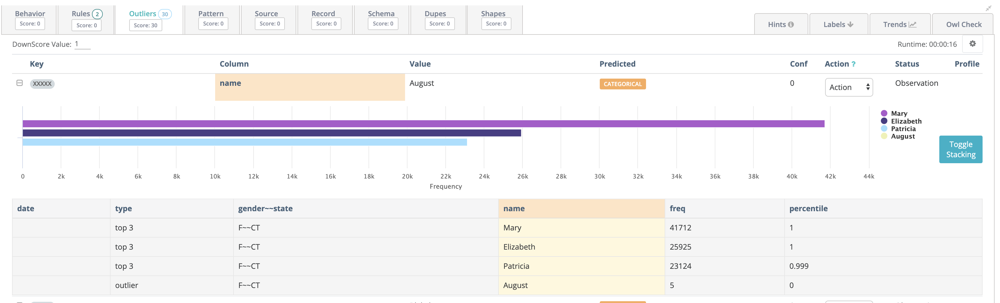
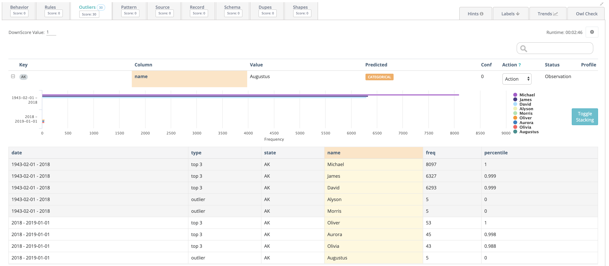
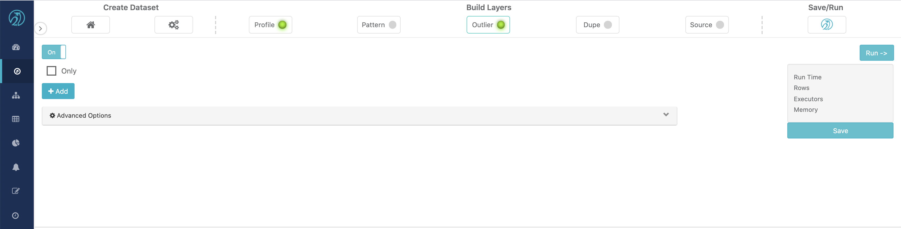
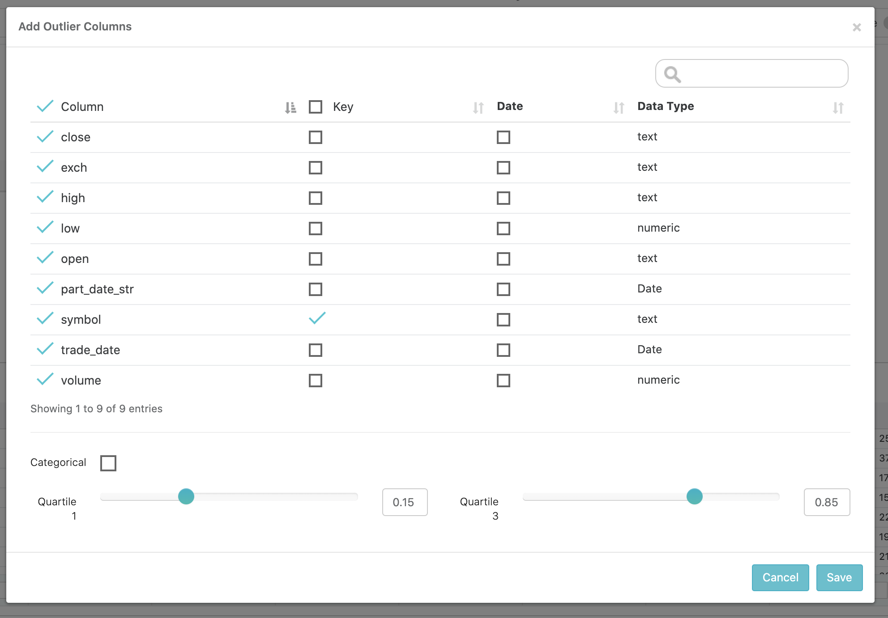
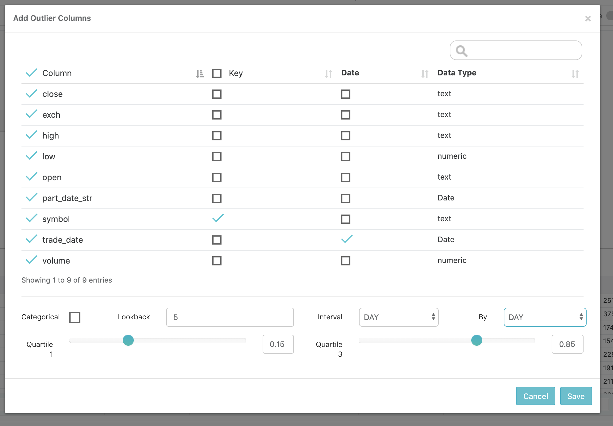
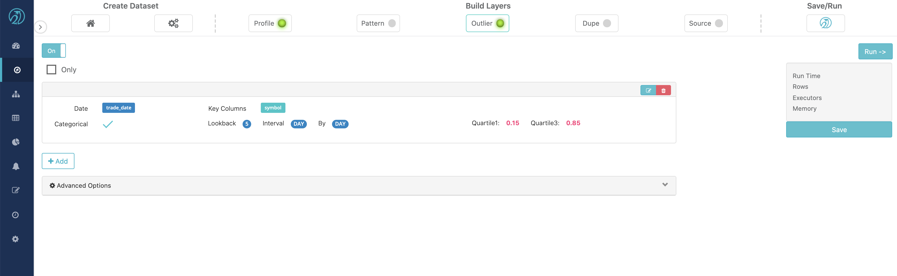
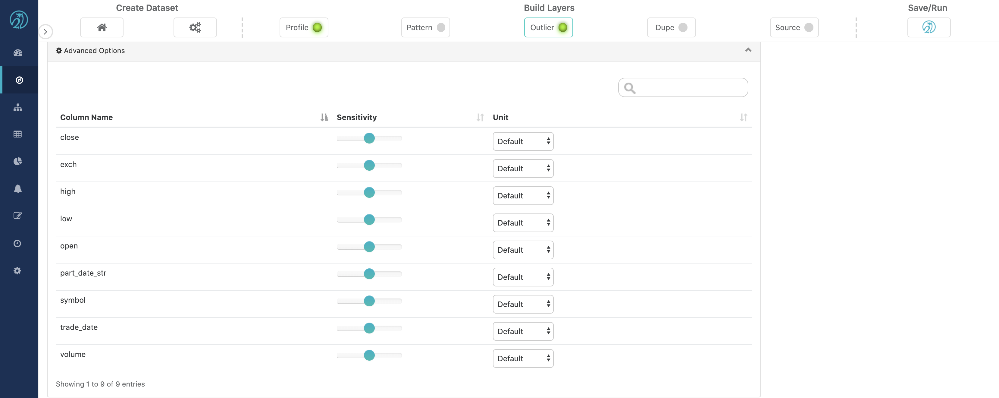
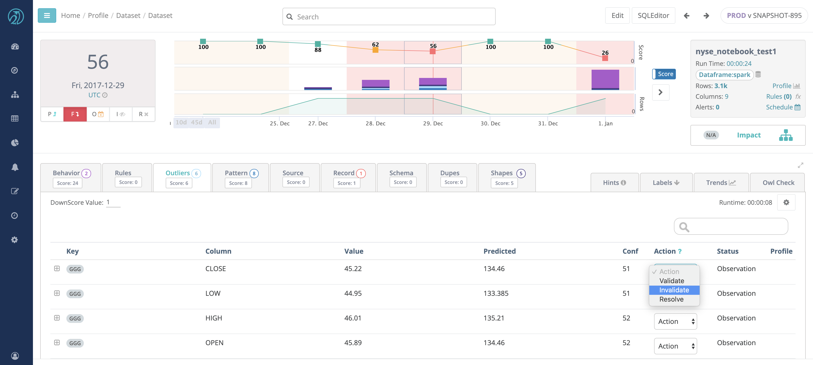

# Outliers

## Numerical Outliers

Kodak Coin! In 2018 Kodak announced themselves as Kodak coin and witnessed a steep change in their stock price. Owl automatically captured this event and provided the ability to drill into the item.


### Complex outliers made Simple

Even though Owl uses complex formulas to identify the correct outliers in a dataset, it uses simple terms when displaying them. If you notice below the change happened gradually, therefore if you only compared avgs or previous values you would not understand the full impact of this price change. 0% changed from yesterday and its moving/trailing avg would have caught up.


## Categorical Outliers

Categorical Outliers are much different than numerical outliers and require separate techniques to automatically capture meaningful anomalies. The details regarding Owl's methodology and testing can be found below, 3 minute read on the topic.



Owl will automatically learn the normal behavior of your String and Categorical attributes such as STOCK,OPTION,FUTURE or state codes such as MD,NC,D.C. When a strange pattern occurs \(e.g NYC instead of NY\), Owl will show this as a categorical outlier.

Owl is able to detect Categorical Outliers both with and without taking time into account. If a time dimension is not provided, Owl will calculate the distribution of categorical values within the available data, and identify the values that fall into the most infrequent percentile \(configurable\).  



If a time dimension is provided, Owl will first identify infrequent categories in the historical context and then in the context of the current Owlcheck. Only values that are historically infrequent or non-existent, and are infrequent in the current run will be considered Outliers.



## Training Outlier Detection Model

Although Owl uses different techniques to detect Numerical and Categorical Outliers, the training process is very similar.

At a minimum,  Owl requires historical data that can be used as the training dataset. If no other input is provided, Owl will calculate the normal range for each selected column and look for numerical and categorical outliers within the training dataset without any further context. The output will essentially consist of infrequent values that fall outside the normal range fo each column.



To obtain more targeted results, the Owl requires a "key" column. This column will be used to provide context by grouping each column by the key column. Defining a good key column tends to provide results that are a better indicators of actual data quality issues instead of simply infrequent values.



Another input that can make outlier detection more precise is a data/time column and a look back period.   This enables a more precise calculation of the normal range for a column and in the case of numerical outliers, makes it possible for Owl to establish a trend. Given a time column and key column, Owl will not only identify numerical outliers, it will plot the historical trend of the column value trailing the outlier. 



Owl also allows further refinement of the time dimension by defining time bins and processing intervals. By default, when given a time column, Owl will bin the data into days and process the data in daily interval. However, if the data is high frequency, day bins and day intervals might be too coarse grained. In this case,  it might make more sense to group the data into bins on the minute and process the data in hour or minute intervals. The same concept applies in the other direction. What if the data is already aggregated on the month or year? In this case, it makes more sense to set the bins and intervals to month by month or month by year. 



Some data may be measured in really small or large units or contain a lot of noise. In this case, Owl allows  the user to adjust the sensitivity level and unit of measure for outlier detection on each column. Click the advanced tab to make these adjustments.



Once Outlier detection is complete for a given run, it's time to tune the scoring of the model. Owl allows the user to label any outlier findings as legitimate, thus preventing that outlier from being detected in the future or effecting the score of the current run. In addition, it is possible to define the significance of an outlier finding to a given dataset. This can be accomplished by setting how many quality points should be deducted for each outlier finding on any given run on that dataset.  It is also possibly to adjust sensitivity and unit of measure of future runs by clicking on the small gear icon on the far left of the screen.



## Spark DataFrame Example


#### Real World Example

Imagine you are the data manager at Iowa Department of Commerce, Alcoholic Beverage Division. As part of the Department's open data initiative, the monthly[ Iowa liquor sales data](https://data.iowa.gov/Sales-Distribution/Iowa-Liquor-Sales/m3tr-qhgy) are available to the public for analysis. \(Thank you Iowa!\)

An Iowan data analyst emails you about a data quality issue with **address** for store \#2508 in the year 2016. You quickly run a SQL query on your data warehouse to see what is going on.

```sql
-- Assuming Postgres DB
select date_trunc('MONTH', "date") "date_month", address, count(*) "sales_count"
from iowa_liquor_sales 
where "date" >= '2016-01-01' and "date" < '2017-01-01' and store_number = '2508'
group by date_trunc('MONTH', "date"), address
order by date_month, address
```

| date\_month | address | sales\_count |
| :--- | :--- | :--- |
| 2016-01-01 00:00:00 | 1843 JOHNSON AVENUE, N.W. | 422 |
| 2016-02-01 00:00:00 | 1843 JOHNSON AVENUE, N.W. | 451 |
| 2016-03-01 00:00:00 | 1843 JOHNSON AVENUE, N.W. | 579 |
| 2016-04-01 00:00:00 | 1843 JOHNSON AVENUE, N.W. | 404 |
| 2016-05-01 00:00:00 | 1843 Johnson Avenue, N.W. | 625 |
| 2016-06-01 00:00:00 | 1843 Johnson Avenue, N.W. | 695 |
| 2016-07-01 00:00:00 | 1843 Johnson Avenue, N.W. | 457 |
| 2016-08-01 00:00:00 | 1843 Johnson Avenue, N.W. | 744 |
| 2016-09-01 00:00:00 | 1843 Johnson Avenue, N.W. | 681 |
| 2016-10-01 00:00:00 | 1843 Johnson Avenue, N.W. | 728 |
| 2016-11-01 00:00:00 | 1843 Johnson Avenue, N.W. | 1062 |
| 2016-12-01 00:00:00 | 1843 Johnson Avenue, N.W. | 992 |

Because `store_number` is an unique number assigned to the store who ordered the liquor, the inconsistent `address` values for the same store pose data quality problem. But `address` is a string value that can take many forms. For store \#2508, the reported address value has a shifted behavior from all capital letters starting on May 2016. For other cases, it might be completely different behavior change that you would have to manually check one by one. With over 2,000 unique stores, 19 million rows, and 8 years of data, you need an automated way to detect meaningful categorical outliers.

The following command shows an example of running monthly OwlDQ Checks, from the month of Jan 2016 to the month of December 2016. Each monthly run looks back 3 months of data to establish a baseline for categorical columns that you suspect would have similar data quality issues: `store_name`, `address`, and`city`.

```bash
/opt/owl/bin/owlcheck 
  # connection information to data
  -lib "/opt/owl/drivers/postgres/" -driver "org.postgresql.Driver"
  -c, "jdbc:postgresql://localhost:5432/postgres"
  -u, "postgres", "-p", "password"
  # Specify dataset name
  -ds "iowa_liquor_sales_by_store_number_monthly"
  # Specify date filter for the last filter, e.g. date >= '2016-12-01' and date < '2017-01-01'
  -rd "2016-12-01" -rdEnd "2017-01-01" 
  # SQL query template (${rd} and ${rdEnd} matches with -rd and -rdEnd
  -q "select distinct on (date, store_number) date, store_number, store_name, address, city
       from iowa_liquor_sales where date >= '${rd}' and date < '${rdEnd}' "
  # Turn on Outliers
  -dl
  # Group on store_number (optional if no grouping)
  -dlkey "store_number"
  # Specify column that is of date type (optional, if running OwlCheck without time context)
  -dc "date"
  # Specify columns to run Outlier analysis (if not specified, all the columns in query are included in analysis)
  -dlinc "store_name,address,city"
  # Specify 3 month lookback for each OwlCheck
  -dllb 3 
  # Run Monthly OwlCheck
  -tbin "MONTH"
  # "backrun" Convenient way to run 12 preceding MONTHly owl check
  -br 12
```

**Results**

The `-br 12` option ran 12 monthly OwlChecks for every month of 2016. The figure below shows OwlCheck Hoot page for the lastest run of dataset `iowa_liquor_sales_by_store_numbers_monthly`. The Hoot page shows that OwlCheck identified 24 Outliers among 4.8k rows of unique date x store\_number for month of December, 2016.


Since the original data quality issue that inspired us to run OwlCheck is from May 2016, we can navigate to specific run date 2016-05-01 by click on the line graph on top. Then searching for store \#2508 on the **key** column shows outlier detected for **column** `address`. Press \[+\] for that row to see contextual details about this detected value.


We can verify that OwlCheck identified the outlier of interest among other 60 data quality issues. Using OwlCheck, you can identify issues at scale for past data \(using backrun\), current \(using simple OwlCheck\), and future \(using scheduled jobs\).

