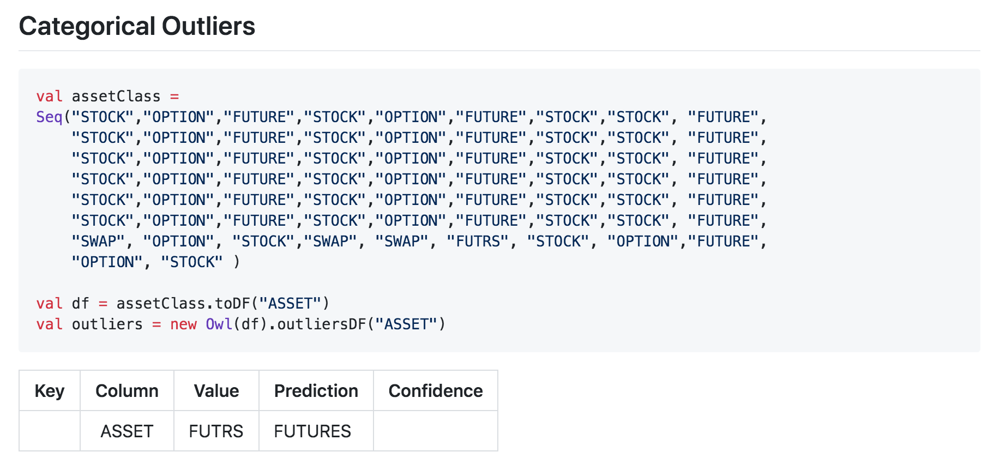
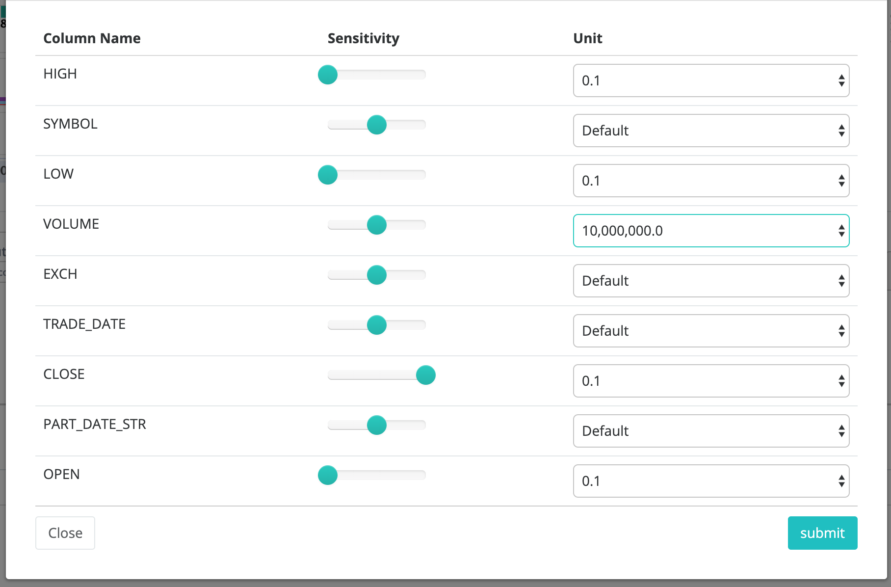

# Outliers

## Numerical Outliers

Kodak Coin! In 2018 Kodak announced themselves as Kodak coin and witnessed a steep change in their stock price. Owl automatically captured this event and provided the ability to drill into the item.

### Complex outliers made Simple

Even though Owl uses complex formulas to identify the correct outliers in a dataset, it uses simple terms when displaying them. If you notice below the change happened gradually, therefore if you only compared avgs or previous values you would not understand the full impact of this price change. 0% changed from yesterday and its moving/trailing avg would have caught up.

## Categorical Outliers

Categorical Outliers are much different than numerical outliers and require separate techniques to automatically capture meaningful anomalies. The details regarding Owl's methodology and testing can be found below, 3 minute read on the topic.



Owl will automatically learn the normal behavior of your String and Categorical attributes such as STOCK,OPTION,FUTURE or state codes such as MD,NC,D.C. When a strange pattern occurs \(e.g NYC instead of NY\), Owl will show this as a categorical outlier.

## Training Outlier Detection Model

Although Owl uses different techniques to detect Numerical and Categorical Outliers, the training process is very similar.

At a minimum,  Owl requires historical data that can be used as the training dataset. If no other input is provided, Owl will calculate the normal range for each selected column and look for numerical and categorical outliers within the training dataset without any further context. The output will essentially consist of infrequent values that fall outside the normal range fo each column.

To obtain more targeted results, the Owl requires a "key" column. This column will be used to provide context by grouping each column by the key column. Defining a good key column tends to provide results that are a better indicators of actual data quality issues instead of simply infrequent values.

Another input that can make outlier detection more precise is a data/time column and a look back period.   This enables a more precise calculation of the normal range for a column and in the case of numerical outliers, makes it possible for Owl to establish a trend. Given a time column and key column, Owl will not only identify numerical outliers, it will plot the historical trend of the column value trailing the outlier. 

Owl also allows further refinement of the time dimension by defining time bins and processing intervals. By default, when given a time column, Owl will bin the data into days and process the data in daily interval. However, if the data is high frequency, day bins and day intervals might be too coarse grained. In this case,  it might make more sense to group the data into bins on the minute and process the data in hour or minute intervals. The same concept applies in the other direction. What if the data is already aggregated on the month or year? In this case, it makes more sense to set the bins and intervals to month by month or month by year. 

Once Outlier detection is complete for a given run, it's time to tune the scoring of the model. Owl allows the user to label any outlier findings as legitimate, thus preventing that outlier from being detected in the future or effecting the score of the current run. In addition, it is possible to define the significance of an outlier finding to a given dataset. This can be accomplished by setting how many quality points should be deducted for each outlier finding on any given run on that dataset.  

## Spark DataFrame Example

### Outlier Tuning - Filter out the Noise

By clicking the gear icon in the upper right corner of the OUTLIER tab on the HOOT page you will see this modal.  Below is a common example of how we at Owl tune end of day stock data.

