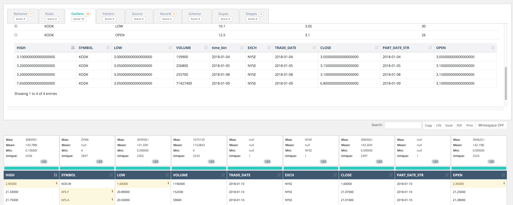

# Outliers

### Numerical Outliers

Kodak Coin!  in 2018 Kodak announced themselves as Kodak coin and witnessed a steep change in their stock price.  Owl automatically captured this event and provided the ability to drill into the item.

### Categorical Outliers

A 3 minute read on the topic.



Owl will automatically learn the normal behavior of your Strings and Categorical attributes such as STOCK,OPTION,FUTURE  or state codes such as . MD,NC,D.C.    when a strange pattern occurs such as NYC instead of NY Owl will show this as a categorical outlier.

### Spark DataFrame Example

