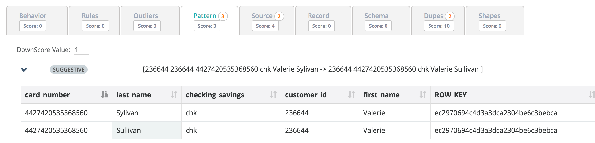
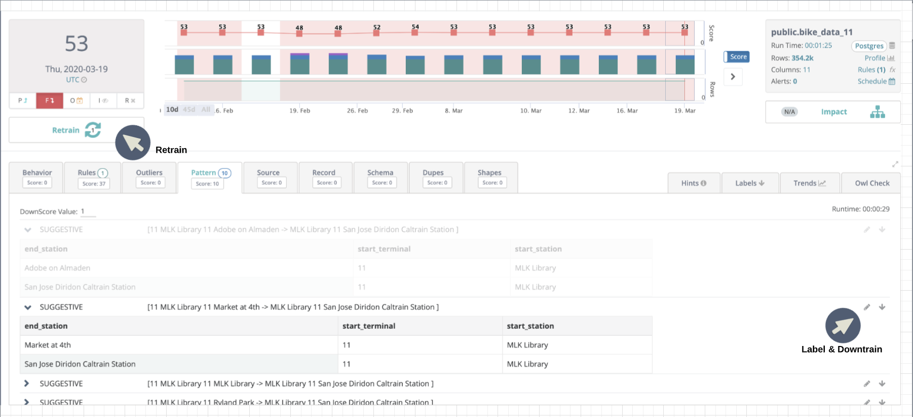

# Pattern Mining

Owl uses the latest advancements in data science and ML to find deep patterns across millions of rows and columns. In the example below it noticed that Valerie is likely the same user as she has the same customer\_id and card\_number but recently showed up with a different last name. Possible misspelling or data quality issue?

## Training Anti-Pattern Detection Model

When the Patterns feature is enabled, Owl will build a collection of patterns that it identifies within the data. It will then use that collection to identify values that break established patterns. For example, in the image below, Owl learned that a bike route that starts at "MLK library" will end at "San Jose Diridon Caltrain Station". However, when the current day's data cross referenced against this pattern, Owl detects an anti-pattern where a trip starts at "MLK Library" but ends at "Market at 4th". Owl raises this anti-pattern as a data quality issue and highlights the what it believes the "end\_station" value should have been.

To build a Pattern model, Owl requires historical data that contains the valid patterns and if possible, a date/time column.  The user can then needs to define the date/time column, the look back period, and what columns make up the pattern. In the image below, the pattern was composed of "end\_station", "start\_terminal", "start\_station". 

It is possible that an apparent anti-pattern finding is actually valid data and not a data quality issue. In this case, Owl allows the user to further instruct the existing Patterns model on how to properly score and handle the findings. For example, if it turns out that "Market at 4th" is actually a valid "end\_station" for a bike trip, the user can negate the identified anti-pattern by labeling it as valid. This action will instruct Owl to not raise this particular anti-pattern again. Owl will also rescore the current Owlcheck results to reflect the user's feedback. In addition, it is possible to define the weight of an anti-pattern finding on the current dataset by setting the numerical value to deduct per finding.

## Fraud Detection?

Think about a scenario where a dataset has a SSN column along with FNAME, LNAME and many others. What if your traditional rules engine passes because one of the rows has a valid SSN and a valid Name but the SSN doesn't belong to that person \(his or her name and address, etc...\)? This is where data mining can derive more sophisticated insights than a rules based approach.

