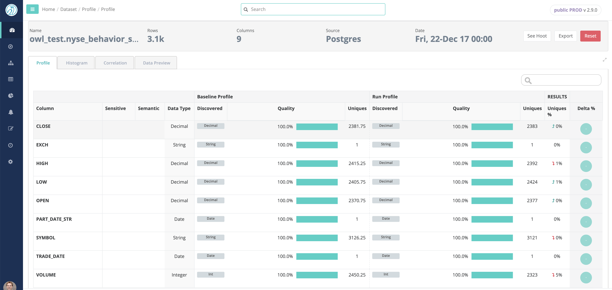
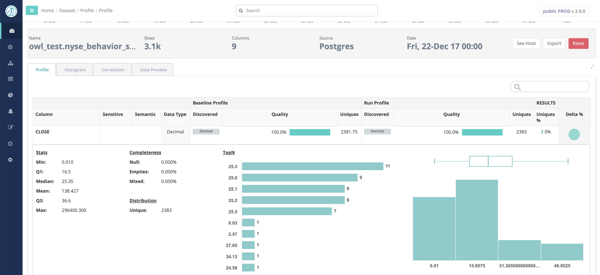

# Profile

## Automatically Profile

Owl automatically profiles your datasets over time so you can drill into when things changed. A profile is just the first step towards an amazing amount of auto discovery. Visualize segments of the dataset and how how the dataset is changing over time.

## Filtergraming + Histograming + Correlations

## Profile Delta

Automatically overlay the current view of your data with its baseline to extract sudden changes.

The profile includes a range of statistics

* Actual Datatype
* Discovered Datatypes
* Percent Null
* Percent Empty
* Percent Mixed Types
* Cardinality
* Minimum
* Maximum
* Mean
* TopN / BottomN
* Value Quartiles

## Correlation Matrix

Discover hidden relationships and measure the strength of those relationships.

## Histograms

Often the first step in a data science project is to segment the data. Owl automatically does this using histograms.

