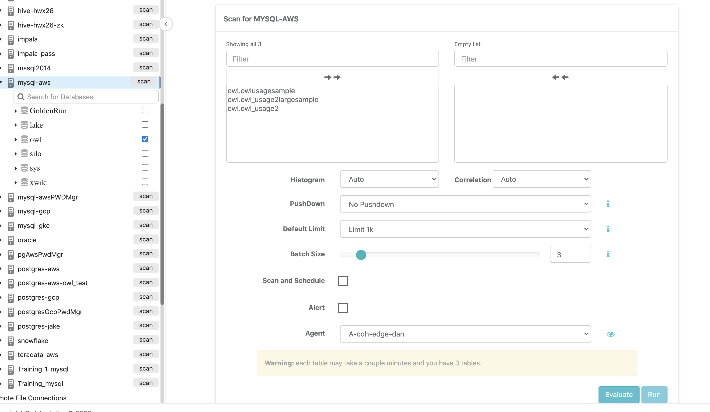
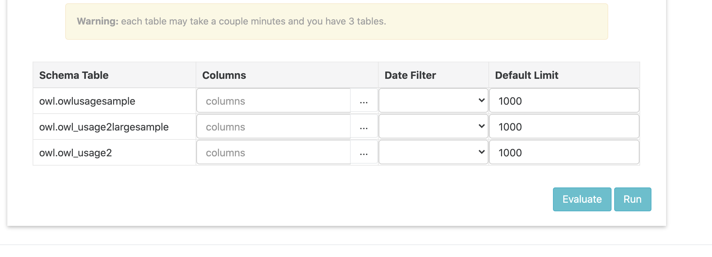

# AutoProfile

**AutoProfile** allows you to select a set of databases and tables to quickly be cataloged. Each selected table will be profiled and added to the Owl Catalog via the selected agent. Various parameters like Alerts, Job Schedules, limits, and more can also be set.

‌When you expand a datasource in the **Explorer** page, you're given a list of possible databases and their associated tables. **AutoProfile** is triggered when you select the ones you want and hit scan. This will take you to a separate page that allows you to configure the various AutoProfile parameters.

A SparkSubmit will be launched for each table, so make sure the agent configuration is reasonable and the box has enough resources to handle each job.

**Global Parameters**

 **Histogram** and **Correlation**: Enable or Disable

 **PushDown**: Set metrics that will be run against the entire table, ignoring limit values.

 **Default Limit**: The default row limit to set for each table to be scanned.

 **Batch Size**: The number of concurrent SparkSubmit jobs the agent will be allowed to run.

 **Scan and Schedule** : Enable scheduling.

 **Alert**: Enable email alerts.

 **Agent**: The agent under which jobs will run.

**Per Table Parameters**

 **Columns**: The columns to select from \(if none are specified, we assume all columns to be selected\).

 **Date Filter**: The date column to be used as the `runDate` parameter when the job runs.

 **Default Limit**: Per table limits.

