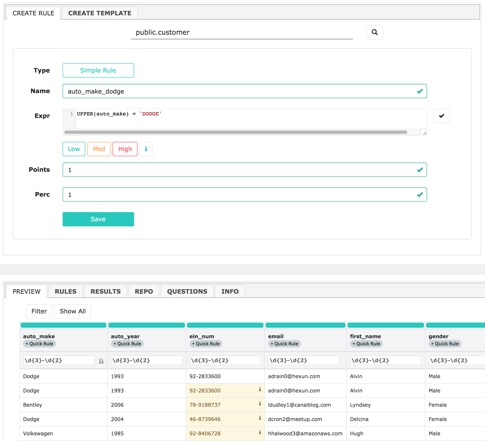

# Rules

### Rules.  Can't live with them, can't live without them.

Owl takes a strong stance that data should first be profiled, auto-discovered and learned before applying basic rules.  This methodology commonly removes thousands of rules that will never need to be written and evolve naturally overtime.  However there are still many cases to add a simple rule, complex rule or domain specific rule.  Simply search for any dataset and add a rule.

### Current Rule Set

Below is a list of one click rules that can be added to any dataset.  It is important to note that Owl often self identifies these columns and automatically provides the proper protection.

* Email
* Zip
* Credit Card
* SSN
* EIN
* State Code
* Phone
* Gender
* IP Address
* Date
* Int
* Double

### Global Shareable Rules

Owl allows a user to define a custom rule and expose it to other users to apply.

### Rule Templates

Create a rule once using our rule template builder and re-use the rule across any column on any dataset.  Owl will substitute the dataset and column that the rule applies to at runtime.  This commonly saves hundreds of redundant rules that do the same thing but on different column names.

### Rule Repository

Owl shares all of it's out of the box rules with each user/tenant.  This makes it easy to get started quickly and let the team add common rules for specific use-cases.

