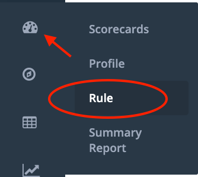
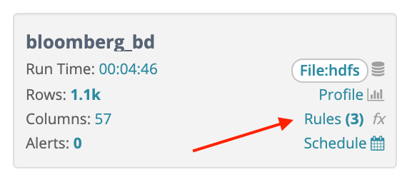

# Creating a Business Rule

Navigate to the Rule page as shown in the screenshot below. By selecting the  icon on the top left corner under the Owl icon and select “Rule”. You will see a page as shown below. 

You can get to rules from the hoot page by clicking on Rules under the dataset name and score in the top right of the screen.‌

##  Instructions                                                

1. Search for a dataset 
   * Rules can only be applied to datasets that have had an Owlcheck scan or previously catalogued
2. Click Load 
   * This will populate the schema and any previously saved rules
3. Select a rule type 
   * Using the dropdown next to the Type label
4. Select a rule name 
   * If applying a preset rule, the rule name will be auto populated
5. Input a rule condition
   * Only if applying a simple, freeform sql, or function rule type, provide a value in the condition/sql/function input field. 
   * Keystroke Ctrl+Space will provide IntelliSense
6. Select Low, Medium or High scoring sever 
7. Click submit to save the rule.

‌The rule will be applied to the next OwlCheck run on that particular dataset.‌

#### **Rule Types** 

1. When to use a simple rule:
   * Simple rules would be applied to filter a condition on a single column in a single table.
   * Example: city = 'Baltimore'
2. When to use a freeform sql rule:
   * ​Complex \(freeform sql\) would be used when applying a condition across multiple tables/columns and generally when more flexibility/customization is desired.
   * ​Example: select \* from dataset where name = 'Owl'
3. When to use a preset rule:
   * Preset rules would be used for quickly adding strict condition check. Commonly used conditions are available to add to any dataset columns.‌

All built-in spark functions are available to use. \([https://spark.apache.org/docs/2.3.0/api/sql/](https://spark.apache.org/docs/2.3.0/api/sql/)\) for simple and freeform sql rules.‌

#### **Points and Percentage** 

For every percentage the X condition occurs, deduct Y points from the data quality score. If a rule was triggered 10 times out of 100 rows, break records occurred 10% of the time. If you input 1 point for every 1 percent, 10 points would be deducted from the overall score.‌

#### **Creating Your First Rule** 

Let’s create a simple rule using the below information. The dataset name.

1. Search for “shape\_example” and click “Load”
2. Select “Simple Rule”
3. Rule Name = lnametest
4. @shape\_example.lname = “hootbeck” \(should hit one time day over day\).
5. Points = 1
6. Percentage = 1
7. Click “Submit”

Once the rule has been submitted please find the below list of rules with the new rule we just defined as shown below.

#### **Seeing Your First Rule Get Triggered** 

Rule scores will appear under the Rule tab on the Hoot page. You can also see more details in the bottom panel of the Rules page under the Rules and Results tabs.

