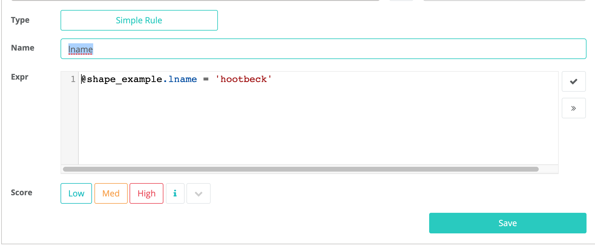
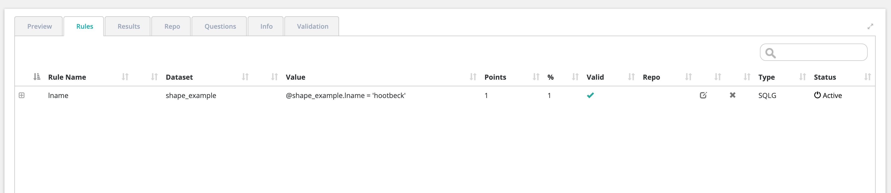
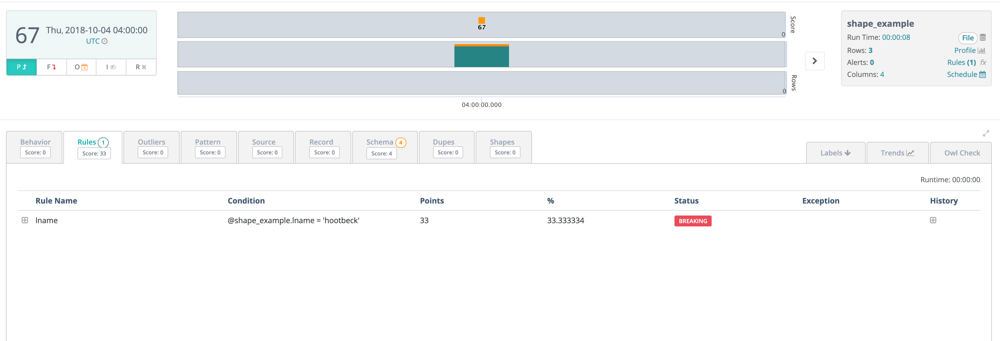
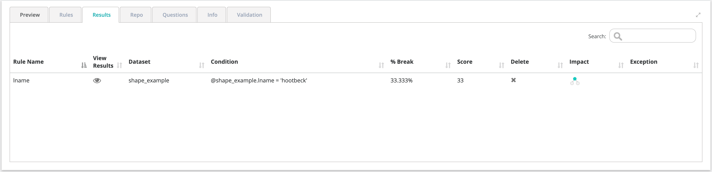

# Creating a Business Rule

Navigate to the Rule page as shown in the screenshot below. By selecting the  icon on the top left corner under the Owl icon and select “Rule”. You will see a page as shown below. NOTE: You can get to rules from the DatasetStats page by clicking on Rules under the dataset name and score in the top right of the screen.‌

1. Select a rule type using the drop-down menu.                                                                
2. Search for a dataset name \(that has been Owlcheck’ed - or this information will be auto-populated if coming from a DatasetStat page\). Once a dataset has been loaded the schema on the left will get populated. \(Example: begin typing in shape\_example dataset from the demo.sh script we ran earlier in this document when the dataset if found click “Load”\). 

   

3. Select a rule type using the drop-down menu                                             
4. Select a rule name. \(Note: If applying a preset rule, the rule name will be auto populated.\)

   ​​

5. If applying a simple, freeform sql, or function rule type, provide a value in the condition/sql/function input field. NOTE: keystroke Ctrl+Space will provide IntelliSense.

   ​​

6. Input a points and percentage value and click submit to save the rule.

   ​​

‌The rule will be applied to the next OwlCheck run on that particular dataset.‌

#### **Rule Types** 

1. When to use a simple rule:
   1. Simple rules would be applied to filter a condition on a single column in a single table.
   2. Example: city = 'Baltimore'
2. When to use a freeform sql rule:
   1. ​Complex \(freeform sql\) would be used when applying a condition across multiple tables/columns and generally when more flexibility/customization is desired.
   2. ​Example: select \* from dataset where name = 'Owl'
3. When to use a preset rule:
   1. Preset rules would be used for quickly adding strict condition check. Commonly used conditions are available to add to any dataset columns.‌

All built-in spark functions are available to use. \([https://spark.apache.org/docs/2.3.0/api/sql/](https://spark.apache.org/docs/2.3.0/api/sql/)\) for simple and freeform sql rules.‌

#### **Points and Percentage** 

For every percentage the X condition occurs, deduct Y points from the data quality score. If a rule was triggered 10 times out of 100 rows, break records occurred 10% of the time. If you input 1 point for every 1 percent, 10 points would be deducted from the overall score.‌

#### **Creating Your First Rule** 

Let’s create a simple rule using the below information. The dataset name.

1. Search for “shape\_example” and click “Load”
2. Select “Simple Rule”
3. Rule Name = lnametest
4. @shape\_example.lname = “hootbeck” \(should hit one time day over day\).
5. Points = 1
6. Percentage = 1
7. Click “Submit”

Once the rule has been submitted please find the below list of rules with the new rule we just defined as shown below.

#### **Seeing Your First Rule Get Triggered** 

Rule scores will appear under the Rule tab on the Hoot page. You can also see more details in the bottom panel of the Rules page under the Rules and Results tabs.

