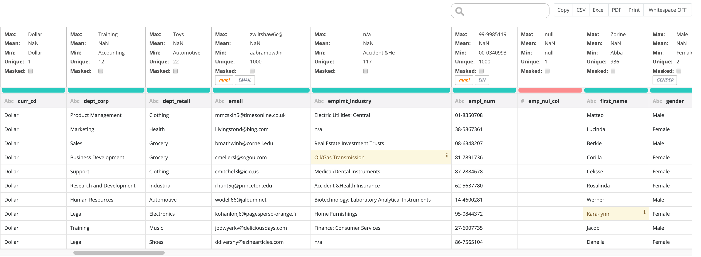

# The best DQ rule, is the one you don't have to write

Owl's semantic scanning self identifies standard columns and automatically provides the proper protection. This makes it easy to get started adding common rules for specific use-cases. 

