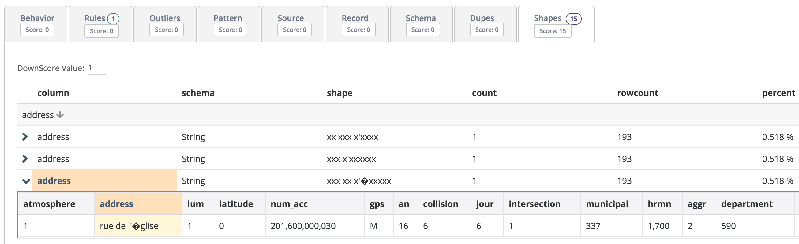
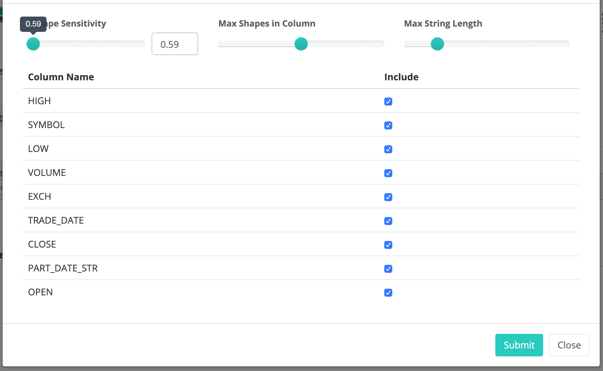

# Shapes

Owl will automatically detect inconsistencies in data formats. These inconsistencies are where Data Scientists spend an enormous amount of time cleaning the data before building a ML model. Many reports have documented that over 80% of the time it takes to build a credible model comes from first understanding all the different formats and then writing munging or ETL style code to clean it before processing. What about all the patterns the process or person doesn't even know about? See Owl auto-clean for more information.

### Drill-in to any Shape anomaly and see a visual example

See an itemized list view of the most infrequent or odd shapes in your datasets.

### Shape Tuning 

By clicking the gear icon in the upper right corner of the SHAPE tab on the HOOT page. 

