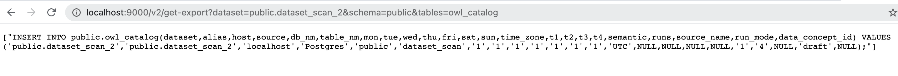
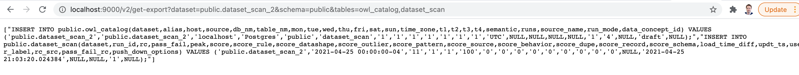
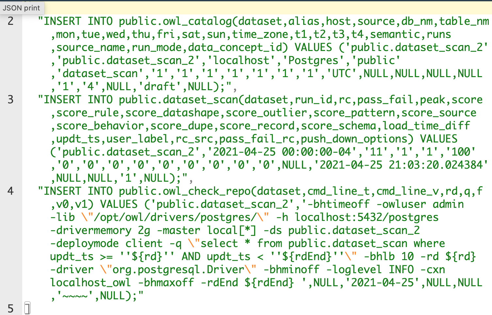

# Export and Import API

### Step 1

Pass your dataset and tables to the following api call. This endpoint will create a JSON payload

```javascript
http://<url>/v2/get-export?dataset=public.dataset_scan_2&schema=public&tables=owl_catalog,dataset_scan,owl_check_repo
T
```

Examples:





### Step 2

Run import on the desired environment, passing the output of the previous statement to the body of the request 

```javascript
http://<url>/v2/run-import
```

This would be the body of the POST.



#### Notes: 

You will want to modify the import payload to check for differences in connections, agents, spark and environment configurations.


## Get-Exports

Passing in several tables and datasets at once

```javascript
http://<url>/v2/get-exports?dataset=public.dataset_scan_2,public.dataset_scan_1&schema=public&tables=owl_catalog,dataset_scan,owl_check_repo
T
```


## Stored Procedure

The following stored procedure needs to be created in the Owl metastore before this can run. 

```text
CREATE OR REPLACE FUNCTION public.dump(p_schema text, p_table text, p_where text)
 RETURNS SETOF text
 LANGUAGE plpgsql
AS $function$
 DECLARE
     dumpquery_0 text;
     dumpquery_1 text;
     selquery text;
     selvalue text;
     valrec record;
     colrec record;
 BEGIN

     -- ------ --
     -- GLOBAL --
     --   build base INSERT
     --   build SELECT array[ ... ]
     dumpquery_0 := 'INSERT INTO ' ||  quote_ident(p_schema) || '.' || quote_ident(p_table) || '(';
     selquery    := 'SELECT array[';

     <<label0>>
     FOR colrec IN SELECT table_schema, table_name, column_name, data_type
                   FROM information_schema.columns
                   WHERE table_name = p_table and table_schema = p_schema
                   ORDER BY ordinal_position
     LOOP
         dumpquery_0 := dumpquery_0 || quote_ident(colrec.column_name) || ',';
         selquery    := selquery    || 'CAST(' || quote_ident(colrec.column_name) || ' AS TEXT),';
     END LOOP label0;

     dumpquery_0 := substring(dumpquery_0 ,1,length(dumpquery_0)-1) || ')';
     dumpquery_0 := dumpquery_0 || ' VALUES (';
     selquery    := substring(selquery    ,1,length(selquery)-1)    || '] AS MYARRAY';
     selquery    := selquery    || ' FROM ' ||quote_ident(p_schema)||'.'||quote_ident(p_table);
     selquery    := selquery    || ' WHERE '||p_where;
     -- GLOBAL --
     -- ------ --

     -- ----------- --
     -- SELECT LOOP --
     --   execute SELECT built and loop on each row
     <<label1>>
     FOR valrec IN  EXECUTE  selquery
     LOOP
         dumpquery_1 := '';
         IF not found THEN
             EXIT ;
         END IF;

         -- ----------- --
         -- LOOP ARRAY (EACH FIELDS) --
         <<label2>>
         FOREACH selvalue in ARRAY valrec.MYARRAY
         LOOP
             IF selvalue IS NULL
             THEN selvalue := 'NULL';
             ELSE selvalue := quote_literal(selvalue);
             END IF;
             dumpquery_1 := dumpquery_1 || selvalue || ',';
         END LOOP label2;
         dumpquery_1 := substring(dumpquery_1 ,1,length(dumpquery_1)-1) || ');';
         -- LOOP ARRAY (EACH FIELD) --
         -- ----------- --

         -- debug: RETURN NEXT dumpquery_0 || dumpquery_1 || ' --' || selquery;
         -- debug: RETURN NEXT selquery;
         RETURN NEXT dumpquery_0 || dumpquery_1;

     END LOOP label1 ;
     -- SELECT LOOP --
     -- ----------- --

 RETURN ;
 END
 $function$
;
```

This assignment needs added.

```text
alter function dump(text, text, text) owner to ownername;
```

