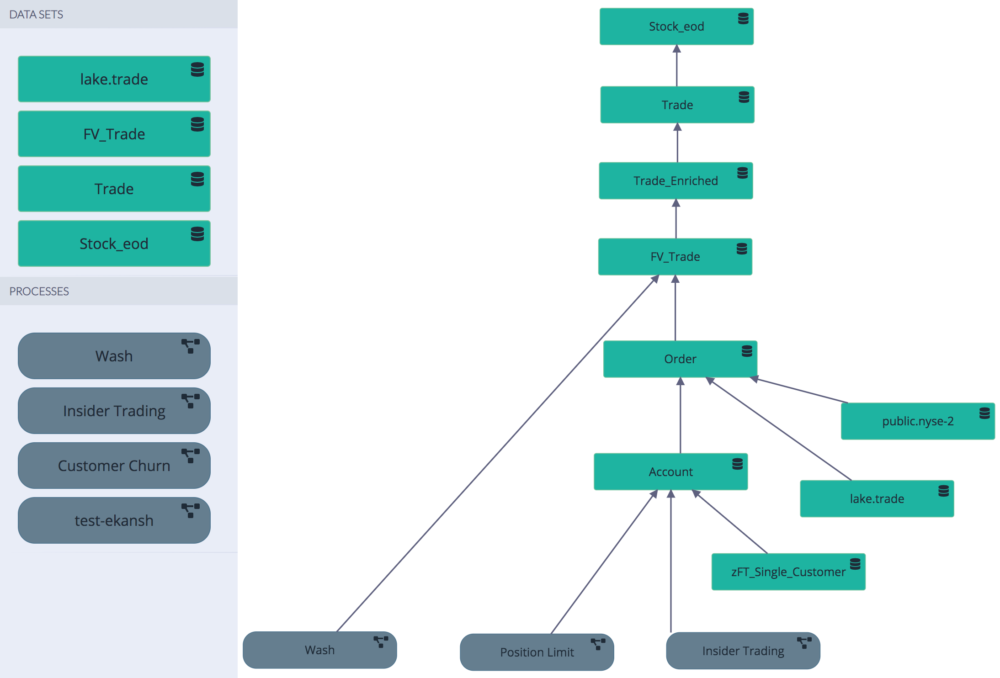

# Dataset Dependency

### How many downstream datasets and processes depend on a single dataset?  Example: end of day stock data \(stock\_eod\)

Quickly what would happen if a single dataset had a column change or quality score dip and how it would impact the downstream datasets and processes.  Business impact per dataset. 

