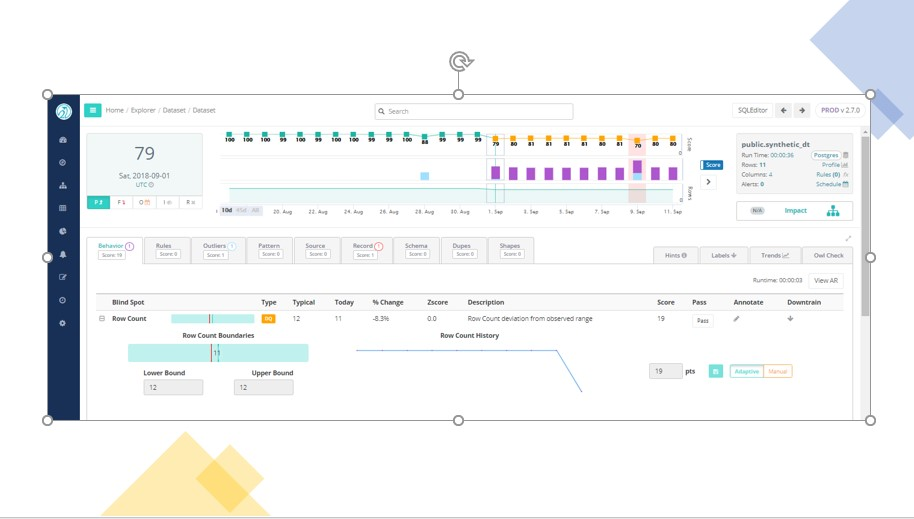

# Healthcare Data Quality

Poor data quality in healthcare is the leading problem that maligns patient outcomes. Hospitals and health information exchanges \(HIEs\) still struggle with patient matching issues, with most citing data quality problems and poor algorithms as top barriers to patient matching. Correctly linking patient data across organizations is a key element of value-based care, patient safety, and care coordination. Duplicate or mismatched records can result in privacy risks, claim denials, redundant medical tests or procedures, and reporting errors.

The lack of accurate and reliable DQ in healthcare leads to dire consequences that are completely preventable, as shown in OwlDQ's troponin example below. Complete and accurate data is a vital component of our complex health system, and anything less is an unacceptable risk.  OwlDQ provides the predictable data quality that healthcare organizations need to deliver high-quality care that we all strive to achieve.

As patient privacy and compliance are of paramount concern, health care organizations need comprehensive auditing and tracking features to guarantee compliance. Data lineage and a historical trail for any data matched, merged or updated help with trace-ability. Organizations also need the ability to perform patient record matching, where error and duplicate rates are monitored and rectified and any access to any patient record is captured. With the proper data protection strategies in place, providers can share sensitive patient data securely, both within and across the organization, manage entitled users and adhere to strict monitoring and reporting regulations.

Once the member, patient, provider, payer and plan data are appropriately organized and continuously cleaned and maintained, the next step is to derive relevant and timely insights from the information. The insights must be in the context of the business user. Predictive analytics and machine learning technologies are helping organizations get relevant insights to improve treatment adherence, reduce readmission and run more impactful preventive and wellness programs. 

**1. Fragmented Data**

Health care data comes from a rapidly growing number of sources.  Different formats, such as structured data, paper, health monitoring IOT devices, wearables, remote monitoring systems, and so on. Data collection and aggregation communities are equally fragmented, making the extraction and integration of data a real challenge. Providers, payers, public health specialists, employers, social network communities and patients all collect data, but there is no effort to unify the information. There is divergence and duplication of data with no single source of truth. This results in inaccurate and incomplete health care member profiles with little insight into a patient’s well-being journey and a member’s ever-evolving relationship with providers, payers, pharmacy, friends and family members. A lack of understanding, monitoring and support cause low adherence and high readmission risks. Poor communication \(particularly during the preoperative phase\) often results in cancellation of procedures, causing loss of revenue and inefficient resource utilization.

**2. Ever-changing Data**

Patients and physicians, like everyone else, move, change their names and professions, retire and die. Payer organizations may also relocate, add new locations or go through various mergers and acquisitions. Moreover, the introduction of new treatments, new drugs and personalized care models change the service delivery and data captured, making it a challenge to keep health care data clean, complete and current. Stale data and information latency directly impact a member’s experience and providers’ business sustainability. The result is a delay in the adoption of new treatment options, inadequate response to health care programs and poor engagement and experience.

**3. Privacy and Security Regulations**

Maintaining patient trust is the cornerstone for building an efficient health care ecosystem. Data security has become of utmost importance to the health care industry as patient privacy depends on HIPAA2 compliance and secure adoption of electronic health records. Also, with ever-changing regulatory requirements, keeping data sets and engagement compliant can be a challenge. Poor data quality and strategy prevent organizations from meeting new regulatory needs and result in high costs associated with audits and reporting. Until data security and compliance issues are adequately addressed, it’s an uphill task to improve the health of the broader population.

**4. Patient Expectations**

The health care industry is about to experience the same shift we saw in retail, banking and hospitality. The health care system is on the verge of a perfect storm. A silver tsunami — in the form of the aging baby boomer population – will put the system through a stress test, while pressures from millennials and Generation Z will force health care organizations to choose newer forms of engagement. Health care organizations must equip themselves for a new age, volume and type of members. The industry will need to have an understanding of members’ changing needs and their preferences and then provide solutions that align with their way of life.

