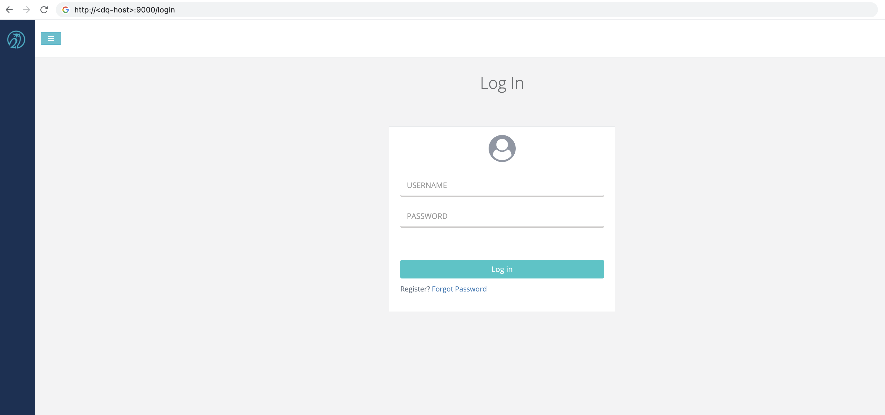
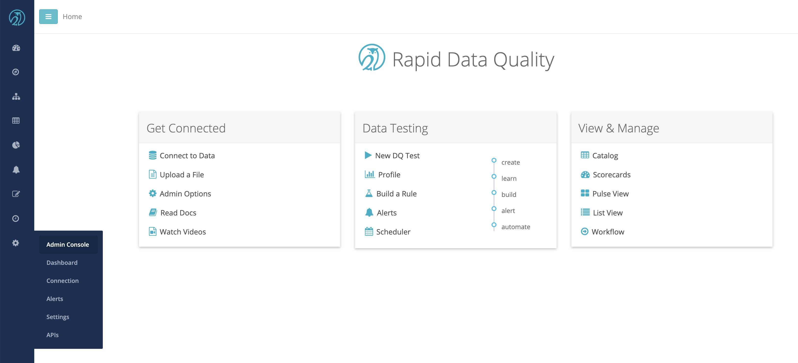
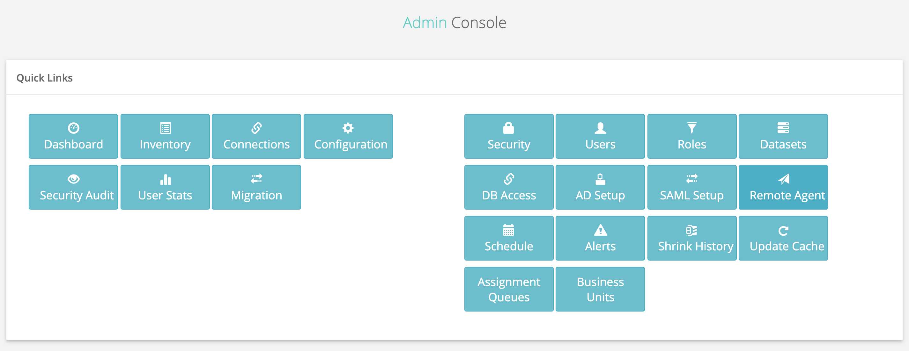
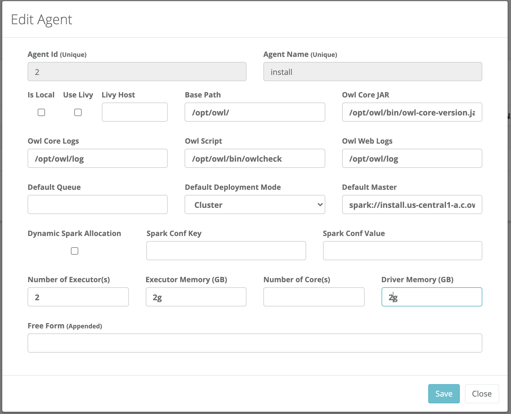
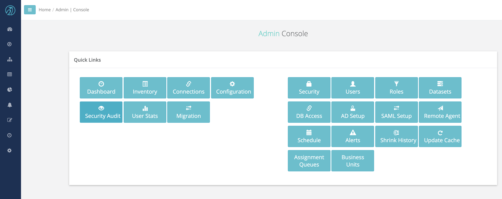
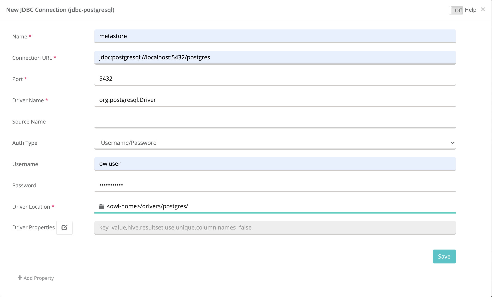
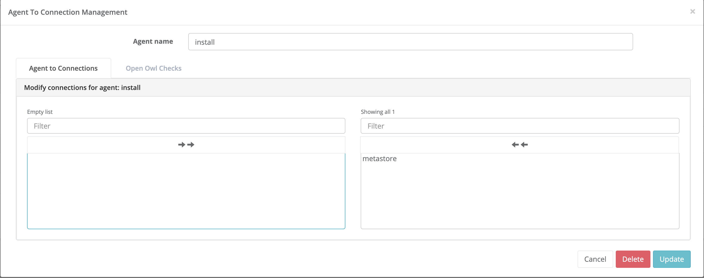

# Full Standalone Install

When large scale and high concurrency checks are not required, DQ can be installed and operated entirely on a single host. In this mode, DQ will leverage a Spark Standalone pseudo cluster where the master and workers run and use resources from the same server. DQ also requires a Postgres database and Java 8. It is possible to install each of the aforementioned components separately  from DQ, however, DQ offers a full install package that deploys all of the required components.


## Initial Install


The full install package supports Centos 7 and RHEL 7. If another OS flavor is required, please follow the basic install process.


```text
export OWL_BASE=<owl-base>
export OWL_METASTORE_USER=<metastore-user>
export OWL_METASTORE_PASS=<metastore-pass>
curl -o dq-full-package.tar.gz "<signed-link-to-full-package>"
tar -xvf dq-full-package.tar.gz
./setup.sh -owlbase=$OWL_BASE -options=postgres,spark,owlweb,owlagent -user=$OWL_METASTORE_USER -pgpassword=$OWL_METASTORE_PASS

checking for Java
Owl Analytics requires and will install a current version of the Java 1.8.x JDK.
Do you wish to continue with install? [Y]es/[N]o y
```


Java 8 is required. The install package will ask for permission to download and install OpenJDK 8. If access to yum repositories containing OpenJDK 8 development package is not possible,  then JAVA\_HOME environment variable must be set to a valid Java home.


The install process will either install Java or create pointers to the Java Home specified in the JAVA\_HOME environment variable. Next, the install process will ask where it should install Postgres. If the data files for the Postgres database need to be hosted at a specific location, provide it during this prompt. Otherwise, just press &lt;Enter&gt; to install the data files into Owl Home.

```text
Postgres DB needs to be intialized. Default location = <owl-home>/postgres/data
to change path please enter a FULL valid path for Postgres and hit <enter>
DB Path [ <owl-home>/owl/postgres/data ] = 
```

The install process will install and configure Postgres and then, install and configure a Spark pseudo cluster on the host. If no exceptions occurred, the process will complete with the following output.

```text
installing owlweb
starting owlweb
starting owl-web
installing agent
not starting agent
install complete
please use owl owlmanage utility to configure license key and start owl-agent after owl-web successfully starts up
```

## Verify Install

The installation process will start the DQ Web Application. This process will handle initializing the metastore schema in Postgres. This process must complete successfully before the DQ Agent can be started. Wait approximately 1 minute and then attempt to access DQ Web using a Web browser to verify successfully startup.



Next, verify that the Spark Cluster has started and is available to run DQ checks. Take note of the Spark Master url \(starting with spark://....\). This will be required during Agent configuration.


## Post Install Configuration

In order for DQ to run checks on data, the DQ Agent must be configured with a license key.

```text
cd <owl-home>
bin/owlmanage.sh setlic=<license-key>
License Accepted new date: <expiration-date>
```

Next, start the DQ Agent process to enable processing of DQ checks.

```text
bin/owlmanage.sh start=owlagent
```

Once the DQ Agent starts, it needs to be configured in DQ Web in order to successfully submit jobs to the local Spark cluster.

Login to DQ Web and navigate to Admin Console.



From the Admin Console, click on the Remote Agent tile.



In the Agent Configuration dialog box, make sure to configure the following settings:

* Owl Base - This is the location that was provided to the setup command for initial install, followed by /owl. For example, if setup command was "export OWL\_BASE=/home/centos" then the Owl Base Agent configuration should be set to "/home/centos/owl".
* Spark Master - The Spark Master Url copied from the Spark cluster verification screen.
* Deploy Mode - Set to Cluster.
* Default resources - Number of executors, memory per executor, number of cores, and driver memory to be allocated for each DQ job by default.




## Run Test DQ Check

Click on the Connections Tile \(top row, left side\) to navigate the to Connection configuration page.



Click on the Postgres connection template and configure the test connection and click save.



Before proceeding to create the run a test DQ check, the DQ Agent must be given rights to run DQ checks against the new JDBC connection. Navigate back to the Admin Console, and click the "Remote Agent" tile. On the left side of the screen select the chain link icon next to the agent that was configured during the installation process. Double click the "metastore" connection from the left text area. Click the "Update" button to save the configuration.



Click the compass icon in the navigation pane to navigate to the Explorer Page. Click on the "metastore" connection, select the "public" schema, and then select the first table in the resulting list of tables. Once the preview and scope tab comes up, click "Build Model". When the Profile page comes up, click the "Run" button.


On the Run page, click the "Estimate Job" button, acknowledge the resource recommendations, and then click the "Run" button.


Click the clock icon in the navigation pane to navigate to the Jobs Page. Wait 10 seconds and then click refresh several times with a few seconds in between clicks. The test DQ check should show and progress through a sequence of activities before settling in "Finished "status.


