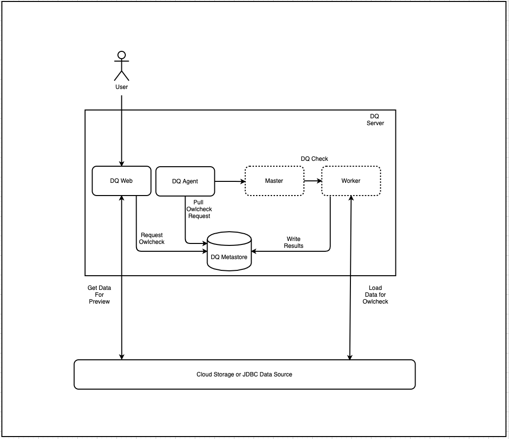
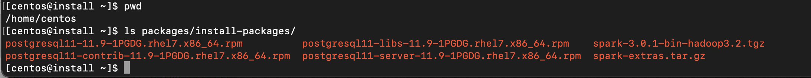
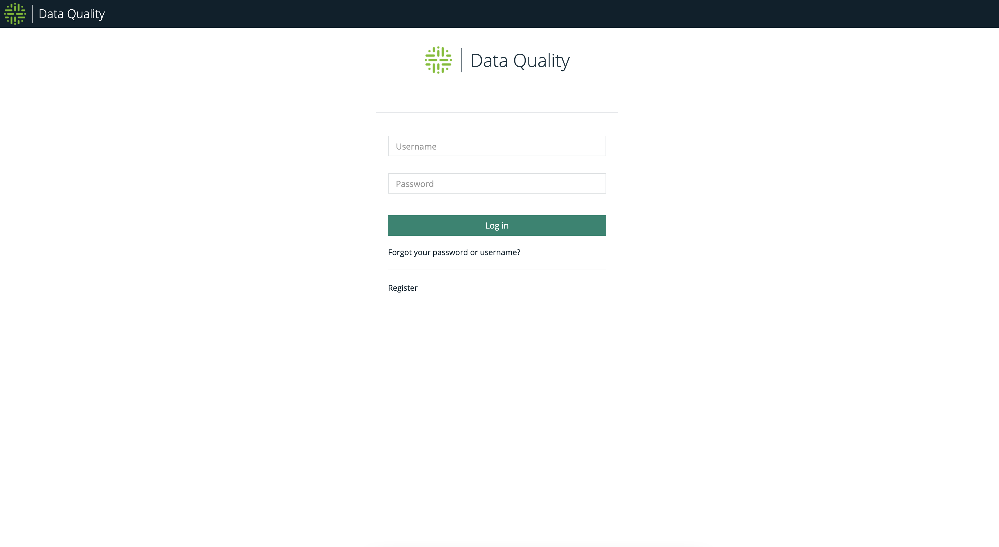
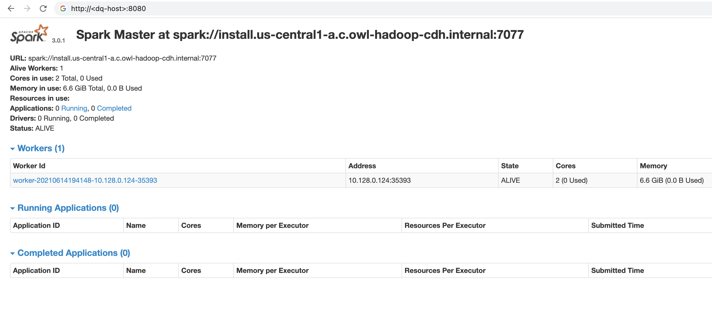
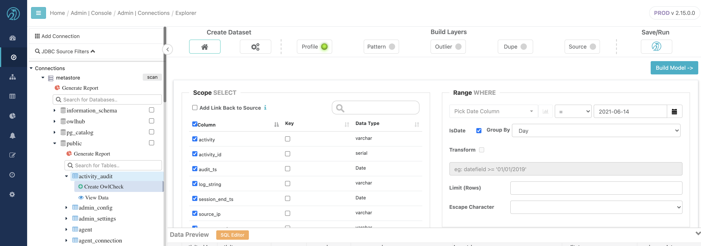
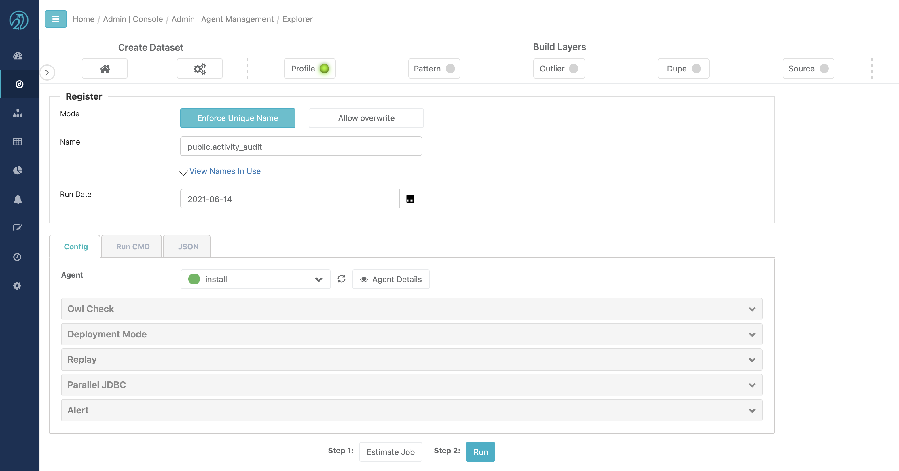
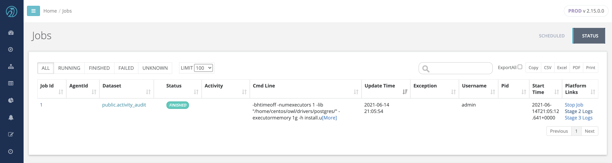

# Full Standalone Install

When large scale and high concurrency checks are not required, DQ can be installed and operated entirely on a single host. In this mode, DQ will leverage a **Spark Standalone pseudo cluster** where the master and workers run and use resources from the same server. DQ also requires a Postgres database for storage and Java 8 for running the DQ web application. It is possible to install each of the Spark, Postgres, and Java 8 components separately and install DQ on top of existing components. However, we offer a full installation package that installs these components in off-line mode and install DQ in one server.



## 0. Setup Tutorial Assumptions

We assume that a server running Centos 7 or RHEL 7 is setup and ready to install DQ in the home directory \(base path: `OWL_BASE`\) under subdirectory `owl`\(install path: `$OWL_BASE/owl`\). There is no requirement for DQ to be installed in the home directory, but the DQ Full Installation script may lead to permission-denied issue during local Postgres server installation if paths other than home directory is used. If so, please adjust your directory permission to allow the installation script a write access to the Postgres data folder.

This tutorial assumes that you are installing DQ on a brand new compute instance on Google Cloud Platform. Google Cloud SDK setup with proper user permission is assumed. This is optional, as you are free to create Full Standalone Installation setup on any cloud service provider or on-premise.

Please refer to the _**GOAL**_ ****paragraph for the intended outcome of each step and modify accordingly


The full install package supports Centos 7 and RHEL 7. If another OS flavor is required, please follow the basic install process.


```text
# Create new GCP Compute Instance named "install"
gcloud compute instances create install \
    --image=centos-7-v20210701 \
    --image-project=centos-cloud \
    --machine-type=e2-standard-4

# SSH into the instance as user "centos"
gcloud compute ssh --zone "us-central1-a" --project "gcp-example-project" "centos@full-standalone-installation"
```


**GOAL**

1. Create a new compute instance on a cloud provider \(if applicable\)
2. Access the server where DQ will be installed. 


## 1. Download DQ Full Package

Download full package tarball using the signed link to the full package tarball provided by the DQ Team. Replace `<signed-link-to-full-package>` with the link provided.

```text
# Go to the OWL_BASE (home directory)
cd ~/ 

# Download & untar
curl -o dq-full-package.tar.gz "<signed-link-to-full-package>"
tar -xvf dq-full-package.tar.gz

# Clean-up unnecessary tarball (optional)
rm dq-full-package.tar.gz
```


**GOAL**

1. Download the full package tarball and place it in the `$OWL_BASE` \(home directory\). Download via `curl` or upload directly via FTP. The tarball name is assumed to be `dq-full-package.tar.gz`for sake of simplicity.
2. Untar`dq-full-package.tar.gz` to `OWL_BASE`.


## 2. Install DQ + Postgres + Spark

First set some variables for `OWL_BASE` \(where to install DQ. In this tutorial, you are already in the directory that you want to install\), `OWL_METASTORE_USER` \(the Postgres username used by DQ Web Application  to access Postgres storage\), and `OWL_METASTORE_PASS` \(the Postgres password used by DQ Web Application  to access Postgres storage\). 

```text
# base path that you want owl installed. No trailing
export OWL_BASE=$(pwd)

export OWL_METASTORE_USER=postgres
export OWL_METASTORE_PASS=password
```


The default username and password for Postgres server that will be installed as part of the tutorial is `postgres`/`password` \(the installation script takes these default values\). If you want to change these values, you must install Postgres separately and configure Postgres permissions independently. If so, skip step \#2 and perform step \#3 instead.


`dq-package-full.tar.gz` that you untarred contains installation packages for Java 8, Postgres 11, and Spark. There is no need to download these components. These off-line installation components are located in `$(pwd)/package/install-packages` .



One of the files extracted from the tarball is `setup.sh`. This script installs DQ and the required components. If a component already exist \(e.g. Java 8 is already installed and `$JAVA_HOME` is set\), then that component is not installed \(i.e. Java 8 installation is skipped\). 

To control which components are installed, use `-options=...`parameter. The argument provided should be comma-delimited list of components to install \(valid inputs: `spark`, `postgres`, `owlweb`, and `owlagent`. `-options=postgres,spark,owlweb,owlagent` means "install Postgres, Spark pseudo cluster, Owl Web Application, and Owl Agent". Note that Java is not part of the options. Java 8 installation is automatically checked and installed/skipped depending on availability. 

You must at minimum specify `-options=spark,owlweb,owlagent` if you independently installed Postgres or using an external Postgres connection \(as you can see in Step \#3 if you choose that installation route\)

```text
# The following installs PostgresDB locally as part of OwlDQ install
./setup.sh \
    -owlbase=$OWL_BASE \
    -user=$OWL_METASTORE_USER \
    -pgpassword=$OWL_METASTORE_PASS \
    -options=postgres,spark,owlweb,owlagent
```


If prompted to install Java 8 because you do not have Java 8 installed, accept to install from local package.



You will be prompted for where to install Postgres like the following image:

```text
Postgres DB needs to be intialized. Default location = <OWL_BASE>/postgres/data
to change path please enter a FULL valid path for Postgres and hit <enter>
DB Path [ <OWL_BASE>/owl/postgres/data ] = 
```

If the data files for the Postgres database need to be hosted at a specific location, provide it during this prompt. **Make sure the directory is writable**. Otherwise, just press &lt;Enter&gt; to install the data files into `$OWL_BASE/owl/postgres/data`. The default suggested path does not have permission issue if you chose home directory as `OWL_BASE`


If no exceptions occurred and installation was successful, then the process will complete with the following output.

```text
installing owlweb
starting owlweb
starting owl-web
installing agent
not starting agent
install complete
please use owl owlmanage utility to configure license key and start owl-agent after owl-web successfully starts up
```


**GOAL**

1. Specify `OWL_BASE` path where DQ will be installed and specify Postgres environment variables
2.  Install DQ Web with Postgres and Spark linked to DQ Agent \(**all files will be in `$OWL_BASE/owl` sub-directory**\) using `setup.sh` script provided.  The location of `OWL_BASE` and Postgres are configurable, but we advise you to take the defaults.


## Step 3_._ Install DQ + Spark and use existing Postgres \(advanced\)


Skip Step 3 if you opted to install Postgres and performed Step 2 instead.



We only recommend Step 3 over Step 2 for advanced DQ Installer


If you have already installed DQ from the previous step, then skip this step. This is only for those who want to use external Postgres \(e.g. use GCP Cloud SQL service as the Postgres metadata storage\). If you have an existing Postgres installation, then everything in the previous step applies except the Postgres data path prompt and the `setup.sh` command

Refer to the Step \#2 for details on what `OWL_BASE`, `OWL_METASTORE_USER` , and `OWL_METASTORE_PASS` are.

```text
# base path that you want owl installed. No trailing
export OWL_BASE=$(pwd)

export OWL_METASTORE_USER=postgres
export OWL_METASTORE_PASS=password
```

Run the following installation script. Note the missing "postgres" in `-options` and new parameter `-pgserver`. This `-pgserver` could point to any URL that the standalone instance has access to.

```text
# The following does not install PostgresDB and 
# uses existing PostgresDB server located in localhost:5432 with "postgres" database
./setup.sh \
    -owlbase=$OWL_BASE \
    -user=$OWL_METASTORE_USER \
    -pgpassword=$OWL_METASTORE_PASS \
    -options=spark,owlweb,owlagent \
    -pgserver="localhost:5432/postgres"
```

The database named `postgres` is used by default as DQ metadata storage. Changing this database name is out-of-scope for Full Standalone Installation. Contact DQ Team for assistance.


**GOAL**

1. Specify `OWL_BASE` path where DQ will be installed and specify Postgres environment variables
2.  Install DQ Web and Spark linked to DQ Agent \(**all files will be in `$OWL_BASE/owl` sub-directory**\) using `setup.sh` script provided and link DQ Web to an existing Postgres server.


## Step 4. Verify DQ and Spark Installation

The installation process will start the DQ Web Application. This process will handle initializing the Postgres metadata storage schema in Postgres \(under the database named `postgres`\). This process must complete successfully before the DQ Agent can be started. Wait approximately 1 minute for the Postgres metadata storage schema to be populated. If you can access DQ Web using `<url-to-dq-web>:9000` using a Web browser, then this means you have successfully installed DQ.



Next, verify that the Spark Cluster has started and is available to run DQ checks using `<url-to-dq-web>:`8080 Take note of the Spark Master url \(starting with `spark://...`\). This will be required during DQ Agent configuration.



## Step 5. Set License Key

In order for DQ to run checks on data, the DQ Agent must be configured with a license key. Replace `<license-key>` with a valid license key provided by the DQ Team.

```text
cd $OWL_BASE/owl/bin
./owlmanage.sh setlic=<license-key>

# expected output:
# > License Accepted new date: <expiration-date>
```

## Step 6. Set DQ Agent Configuration

Next, start the DQ Agent process to enable processing of DQ checks.

```text
cd $OWL_BASE/owl/bin
./owlmanage.sh start=owlagent

# Verify "agent.properties" file is created
cd $OWL_BASE/owl/config
```

When the script successfully runs, `$OWL_BASE/owl/config` folder will contain a file called `agent.properties`. This file contains agent id \# of agents installed in this machine. Since this is the first non-default agent installed, the expected agent id is 2. Verify `agent.properties` file is created. Your`agent.properties` is expected to have different timestamp, but you should see `agentid=2`

```text
cd $OWL_BASE/owl/config
cat agent.properties

# expected output:
> #Tue Jul 13 22:26:19 UTC 2021
> agentid=2
```

Once the DQ Agent starts, it needs to be configured in DQ Web in order to successfully submit jobs to the local Spark \(pseudo\) cluster.

The new agent has been setup with the template base path `/opt` and install path `/opt/owl`. The `owlmanage.sh start=owlagent` script does not respect  `OWL_BASE` environment. **We need to edit the Agent Configuration to follow our** `OWL_BASE`

Follow the steps on [How To Configure Agent via UI](https://docs.owl-analytics.com/installation/agent-configuration#how-to-configure-agent-via-ui) page to configure the newly created DQ Agent and edit the following parameters in DQ Agent \#2. 

* Replace all occurrence of `/opt/owl` with your `$OWL_BASE/owl/`in **Base Path**, **Collibra DQ Core JAR**, **Collibra DQ Core Logs**, **Collibra DQ Script**, and **Collibra DQ Web Logs**.
  * Note that **Base Path** here does not refer to `OWL_BASE`
* Replace **Default Master** value with the Spark URL from Fig 3
* Replace **Default Client Mode** to "Cluster"
* Replace **Number of Executors\(s\)**, **Executor Memory \(GB\)**, **Driver Memory \(GB\)** to a reasonable default \(depending on how large your instance is\)

Refer to [Agent Configuration Parameters](https://docs.owl-analytics.com/installation/agent-configuration#agent-configuration-parameters) for parameters descriptions.


## Step 7. Create DB Connection for DQ Job

Follow the steps on [How to Add DB Connection via UI](https://docs.owl-analytics.com/installation/agent-configuration#how-to-add-db-connection-via-ui) page to add `metastore` database connection. For demo purposes, we will run a DQ Job against local DQ Metadata Storage. 

Follow the steps on [How To Link DB Connection to Agent via UI](https://docs.owl-analytics.com/installation/agent-configuration#how-to-link-db-connection-to-agent-via-ui) page to configure newly created DQ Agent. 

Click the compass icon in the navigation pane to navigate to the Explorer Page. Click on the "metastore" connection, select the "public" schema, and then select the first table in the resulting list of tables. Once the preview and scope tab comes up, click "Build Model". When the Profile page comes up, click the "Run" button.



On the Run page, click the "Estimate Job" button, acknowledge the resource recommendations, and then click the "Run" button.



Click the clock icon in the navigation pane to navigate to the Jobs Page. Wait 10 seconds and then click refresh several times with a few seconds in between clicks. The test DQ check should show and progress through a sequence of activities before settling in "Finished "status.



### Helpful Commands

```text
chmod -R 755 /home/owldq
```

```text
ssh-keygen -t rsa -N "" -f ~/.ssh/id_rsa
cat ~/.ssh/id_rsa.pub >> ~/.ssh/authorized_keys
```

```text
chmod 400 ~/Downloads/ssh_pem_key
```

```text
sudo chmod 777 /home/owldq/owl/pids/owl-agent.pid
sudo chmod 777 /home/owldq/owl/pids/owl-web.pid
```

```text
hostname -f
```

```text
ps -aef|grep owl-web
ps -aef|grep owl-agent
ps -aef|grep spark
ps -aef|grep postgres
```

```text
sudo du -ah | sort -hr | head -5
sudo find /home/centos/spark-3.0.2-bin-hadoop3.2/work/* -mtime +1 -type f -delete
```

```text
vi ~/.bash_profile

export SPARK_HOME=/opt/owl/spark
export PATH=$SPARK_HOME/bin:$PATH
```

