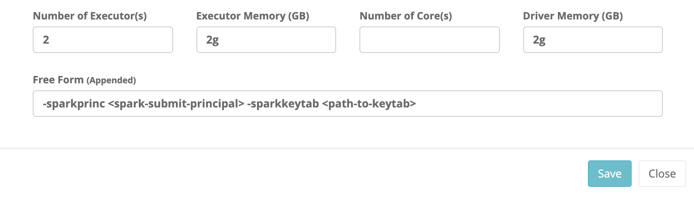

# Hadoop Integration

For large scale processing and concurrency, a single vertically scaled Spark server is not enough. To address large scale processing, DQ has the ability to push compute to an external Hadoop cluster. This page describes the process by which the DQ Agent can be configured to push DQ jobs to Hadoop.

## Hadoop Config Setup

Hadoop configuration can be incredibly complex. There can be hundreds of "knobs" across dozens of different components. However, DQ's goal is to simply leverage Hadoop to allocate compute resources in order to execute DQ checks \(Spark jobs\). This means that the only client side configurations required:

* Security protocol definition
* Yarn Resource Manager endpoints
* Storage service \(HDFS or Cloud storage\). 

Once the Hadoop client configuration is defined, it is only a matter of pointing the DQ Agent at the folder that contains the client configuration files. The DQ Agent is then able to use the Hadoop client configuration to submit jobs to the specified Hadoop cluster.


DQ job running on Hadoop are Spark jobs. DQ will use the storage platform defined in the "fs.defaultFS" setting to distribute all of the required Spark libraries and specified dependency packages like drivers files. This allows DQ to use a version of Spark that is different than the one provided by the cluster. If it is a requirement to use the Spark version provided by the target Hadoop cluster, obtain and use a copy of the yarn-site.xml and core-site.xml from the cluster.


### Create Config Folder 

```text
cd $OWL_HOME
mkdir -p config/hadoop
echo "HADOOP_CONF_DIR=$OWL_HOME/config/hadoop" >> config/owl-env.sh
bin/owlmanage.sh restart=owlagent
```

### Minimum Config \(Kerberos Disabled, TLS Disabled\)

This configuration would typical only be applicable in Cloud Hadoop scenarios \(EMR/Dataproc/HDI\). Cloud Hadoop clusters are ephemeral and do not store any data as the data is stored in and is secured by Cloud Storage. 

```text
export RESOURCE_MANAGER=<yarn-resoruce-manager-host>
export NAME_NODE=<namenode>

tee $OWL_HOME/config/hadoop/core-site.xml <<-'EOF'
<configuration>
  <property>
    <name>hadoop.security.authentication</name>
    <value>simple</value>
  </property>
  <property>
    <name>hadoop.rpc.protection</name>
    <value>authentication</value>
  </property>
  <property>
    <name>fs.defaultFS</name>
    <value>hdfs://$NAME_NODE:8020</value>
  </property>
</configuration>
EOF

tee $OWL_HOME/config/hadoop/yarn-site.xml <<-'EOF'
<configuration>
  <property>
    <name>yarn.resourcemanager.scheduler.address</name>
    <value>$RESOURCE_MANAGER:8030</value>
  </property>
  <property>
    <name>yarn.resourcemanager.address</name>
    <value>$RESOURCE_MANAGER:8032</value>
  </property>
  <property>
    <name>yarn.resourcemanager.webapp.address</name>
    <value>$RESOURCE_MANAGER:8088</value>
  </property>
</configuration>
EOF
```


When deploying a Cloud Service Hadoop cluster from any of the major Cloud platforms, it is possible to use Cloud Storage rather than HDFS for dependency package staging and distribution. To achieve this, create a new storage bucket and ensure that both the Hadoop cluster and the instance running DQ Agent have access to it. This is usually accomplished using a Role that is attached to the infrastructure. For example, AWS Instance Role with bucket access policies. Then, set "fs.defaultFS" in core-site.xml to the bucket path instead of HDFS.


### Kerberos Secured with Resource Manager TLS enabled

Typically, Hadoop cluster that are deployed on-premises are multi-tenant and not ephemeral. This means they must be secured using Kerberos. In addition, all endpoints with HTTP endpoints will have TLS enabled. In addition HDFS may be configured for a more secure communication using additional RPC encryption.

```text
export RESOURCE_MANAGER=<yarn-resoruce-manager-host>
export NAME_NODE=<namenode>
export KERBEROS_DOMAIN=<kerberos-domain-on-cluster>
export HDFS_RPC_PROTECTION=<authentication || privacy || integrity>

tee $OWL_HOME/config/hadoop/core-site.xml <<-'EOF'
<configuration>
  <property>
    <name>hadoop.security.authentication</name>
    <value>kerberos</value>
  </property>
  <property>
    <name>hadoop.rpc.protection</name>
    <value>$HDFS_RPC_PROTECTION</value>
  </property>
  <property>
    <name>fs.defaultFS</name>
    <value>hdfs://$NAME_NODE:8020</value>
  </property>
</configuration>
EOF

tee $OWL_HOME/config/hadoop/hdfs-site.xml <<-'EOF'
<configuration>
  <property>
    <name>hadoop.security.authentication</name>
    <value>HDFS/_HOST@$KERBEROS_DOMAIN</value>
  </property>
</configuration>
EOF

tee $OWL_HOME/config/hadoop/yarn-site.xml <<-'EOF'
<configuration>
  <property>
    <name>yarn.resourcemanager.scheduler.address</name>
    <value>$RESOURCE_MANAGER:8030</value>
  </property>
  <property>
    <name>yarn.resourcemanager.address</name>
    <value>$RESOURCE_MANAGER:8032</value>
  </property>
  <property>
    <name>yarn.resourcemanager.webapp.https.address</name>
    <value>$RESOURCE_MANAGER:8090</value>
  </property>
</configuration>
EOF
```

When the target Hadoop cluster is secured by Kerberos, DQ checks require a Kerberos credential. This typically means that the DQ Agent will need to be configured to include a Kerberos keytab with each DQ check. Access the DQ Agent configuration page from the Admin Console and configure the "Freeform Append" setting with the -sparkprinc &lt;spark-submit-principal&gt; -sparkkeytab &lt;path-to-keytab&gt;.



