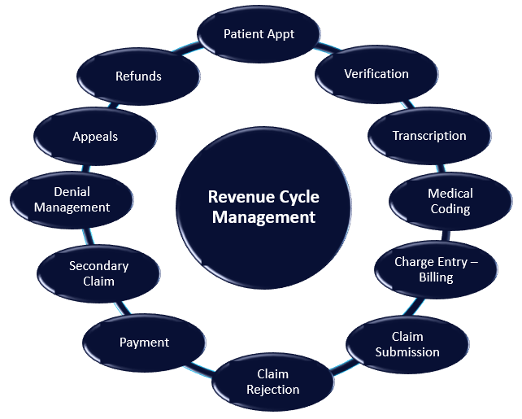

# Health Insurance Claims Data

Revenue Cycle Management is the process of identifying, collecting and managing the practice’s revenue from payers based on the services provided. A complete RCM process is critical for a healthcare practice to maintain financial viability and continue to provide quality care for their patients.

Inaccurate claims data, is the primary cause for diagnostic providers receiving incorrect payments for their services. Most providers struggle with the quality of the data that they receive, and without direct access to the patients, it can be an expensive, laborious process to correct incomplete, or missing data that is required for claim reimbursement.

Cleaning up or correcting incomplete data is not a step in the claims process that can be skipped. It must be done to assure the reimbursement process is accurate, and complete in the agreed time frame. Automating the data quality during intake is the key to the timely completion of the reimbursement process, and saving the cost and effort of correcting the data down stream. 

```text
Increase revenue from insurance and patient payments
Spend less time tracking down missing patient information
Lower error processing rates
Reduce operating costs
Improve claim processing speed
```

The revenue cycle includes all the administrative and clinical functions that contribute to the capture, management and collection of patient service revenue, according to the Healthcare Financial Management Association



```text
Preregistration - Collecting preregistration information
Verification - Patient eligibility and benefit is verified  
Transcription - recording the diagnoses and procedure 
Medical Coding - Properly coding diagnoses and procedures.
Charge capture - Medical services into billable charges.
Claim submission - Submitting claims to insurance companies.
Claim Rejection - when necessary
Payment Posting - Determining patient balances, collection
Secondary Claim Submission
Denial Management - Applying or rejecting payments remittance 
Medical Appeals - Examining the necessity of medical services.
Refund - where aplicable
```


