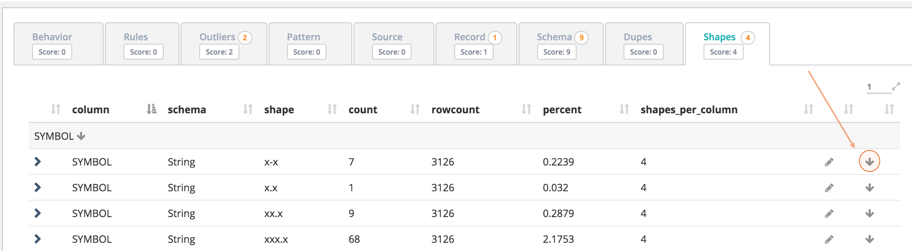

# Item Labeling

## Re-train the Owl DQ Model

By clicking the down arrow, you are telling Owl that this finding is not an actual DQ item. Another way to say it is "I don't want to be alerted to this item in the future". Owl allows a user to annotate the reasoning while keeping an audit log of the event. You can bring the item back into play by navigating to the "Labels" panel and deleting the down trained item. Owl will prompt a user to re-train the model after clicking a down arrow.

