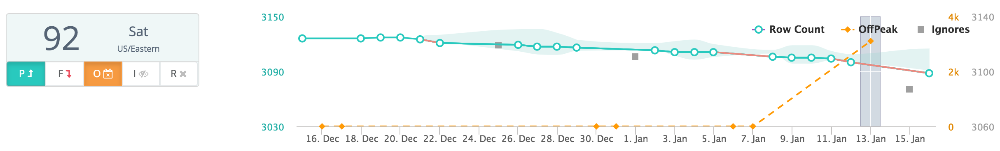
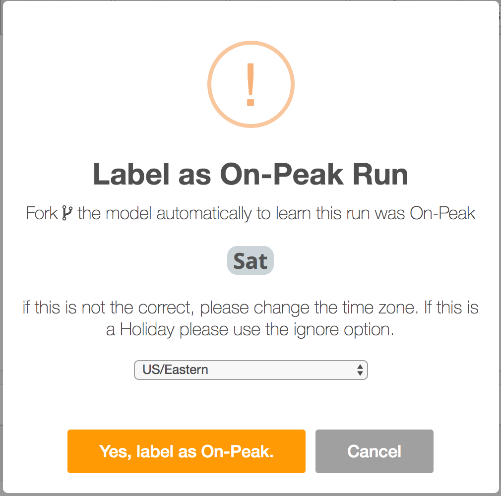

# Peak vs Off Peak

## But my Weekend runs are not the Same

A common scenario that can fool behavioral analytics and ML is when you have 2 or 3 different but normal patterns. Owl has a rich labeling system that allows a user to fork the training model to learn these cycles individually as to not confuse the model.

## Click the Orange Button

By clicking the orange button you can label the day of the week as peak vs off peak. You can also chose your time zone - this will help determine the day of the week accurately. A user only needs to click the peak scheduler once and the model will learn and forecast this understanding for every run in the future. This feature commonly prompts for a re-train.

