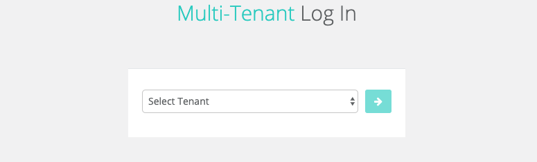
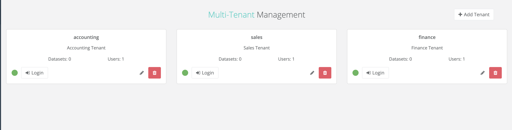

# Multi-Tenancy

### Adding and Editing a Tenant

In many cases it may make sense to have isolated environments to check data quality. This need could be driven by a number of factors including data access rights, organization and business models, reporting needs, and/or other security requirements.

Regardless of the need, Owl will support dynamically creating tenants via our Owl Hub Management portal as part of the Owl Web Application. That's it, there is nothing else to install, simply enable Multi-Tenant mode in the application configuration properties and you are on your way.

Once enabled you will have a tenant selection screen prior to login where you can chose any of your configured tenants or access the Owl Hub \(with the TENANT\_ADMIN role\)

After selecting the owlHub tenant, you will have the ability to manage each tenant, as well as create new tenants from the management console.

All enabled tenants will be listed in the multi-tenant drop down menu. Access to tenants are handled by the administrator\(s\) within each tenant individually.

