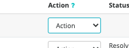
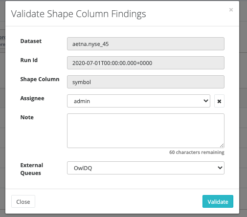

# Assignment Queue\(s\)

OwlDQ provides observations that usually need review to validate. In many cases, it makes sense to assign the validation to a person that has access to the source data. Assignments can be handled by Owl internally, or an existing ServiceNow or JIRA queue when configured.

When reviewing any observation you will notice a column called "Action"

From the action dropdown, if you choose to validate a finding, you will also have the ability to assign that item to another Owl user for further investigation.

If you do not choose an assignee \(X\), it will mark the item as valid, but unassigned: Acknowledged

Your External Queues are where the source of the assignment should be tracked, OWDQ/JIRA/Serive Now are all options. OWLDQ is automatically configured, but you can configure others via the Admin Console and clicking on Assignment Queues. 

