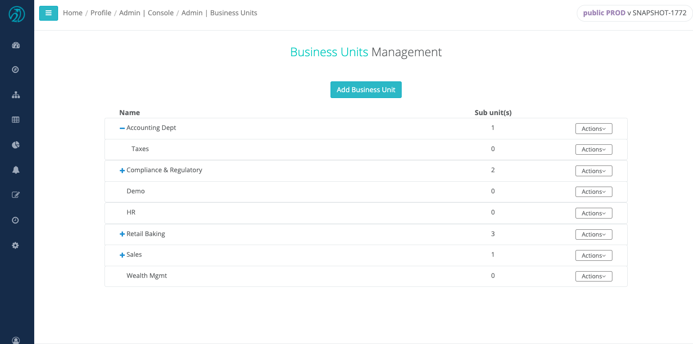
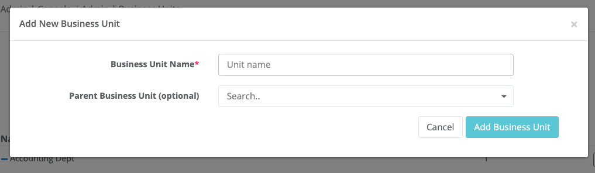
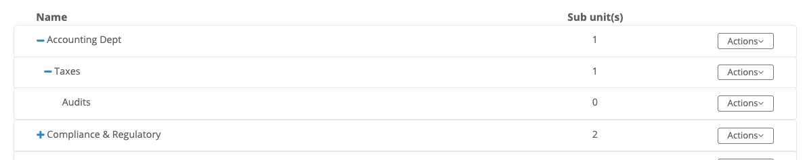
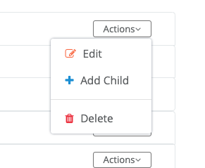
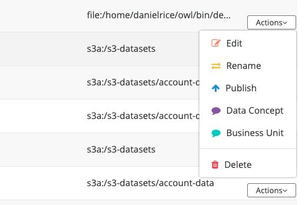
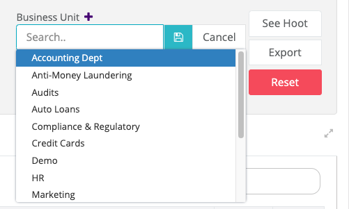
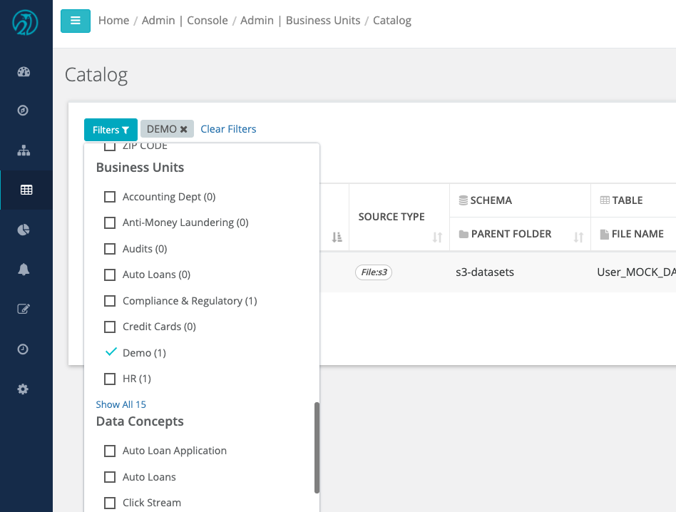
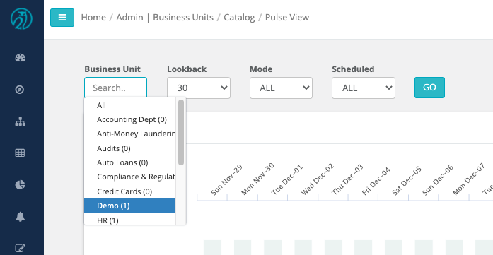

# Business Units

OwlDq allows its users to run large sets of Owl Checks. Business units provide a way to categorize Owl Checks. 

Through the admin console the user can navigate to the business units management page. This page will contain a table of your business units and a button to create new units. 

By clicking the Add Business Unit button the user will be able to fill out the business unit form. A unique name is required and a parent business unit can be optionally selected. Each unit can have one parent and many children. On the business units table you can click the blue plus icon to expand all children for that unit. If any children have children unit they will also have a plus sign to indicate the children rows can be expanded.  

Each business unit has actions. The business unit can be edited or deleted. If the unit is assigned to at least one data set, it cannot be deleted. If the user wishes to create children of a unit they can choose the Add Child action to have the new business unit form pre populated with the selected unit as the parent. 

There are two different ways to assign a business unit to a data set. On the Catalog page there is an action option to manage the business unit. One the profile page the user can click the add/edit business units icon to open a control to manage the assigned business uint. 

Once a business unit has been assigned to a data set the user can filter by that business unit on the Catalog and Pulse View. 

