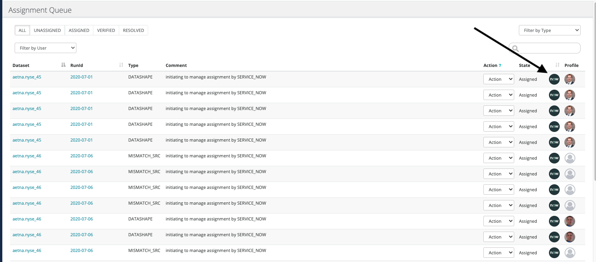
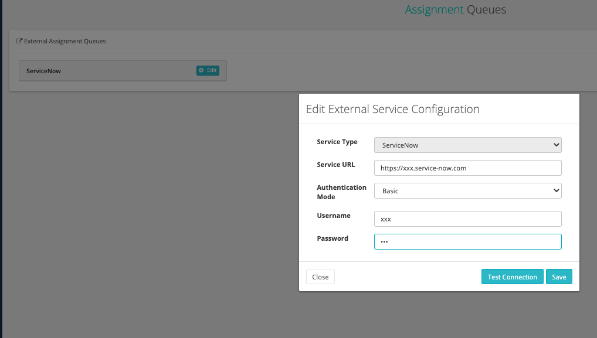

# External Assignment

Owl has the ability to link to an Assignment Queue. You can assign any item to a user that has previously logged into the application and has a matching JIRA or Service Now account. Simply choose the configured queue from the assignment dropdown after choosing the "validate" option from the actions dropdown as previously described.

To configure a queue, you must have ROLE\_ADMIN or ROLE\_CONNECTION\_MANAGER. Go to the Admin Console and click Assignment Queues.

Add or Edit a Service Now or JIRA configuration from the corresponding page.

