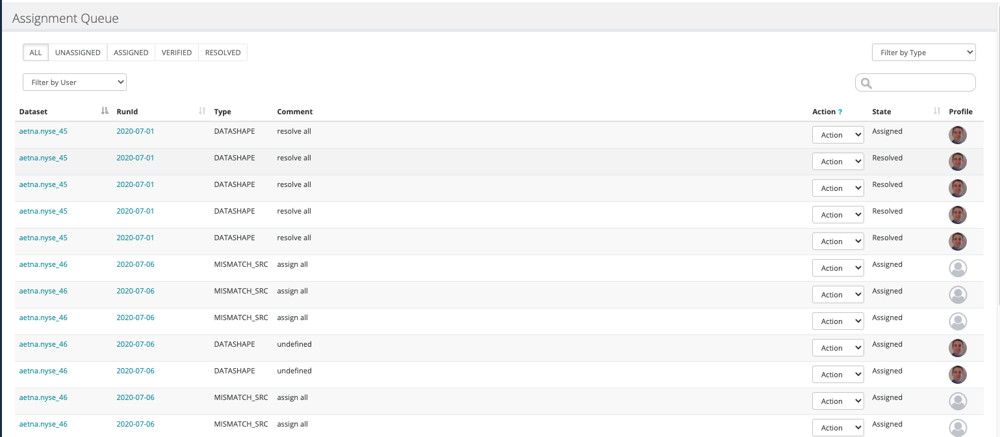

# Internal Assignment

Owl has a built in Assignment Queue. You can assign any item to a user that has previously logged into the application. Simply choose OWLDQ from the assignment dropdown after choosing the "validate" option from the actions dropdown as previously described.

