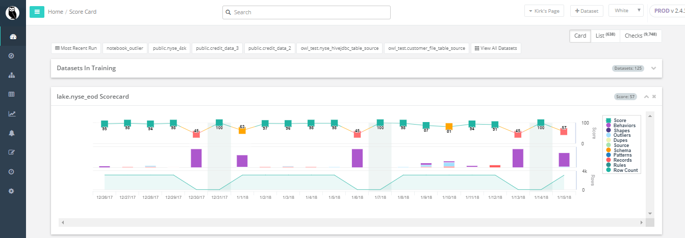
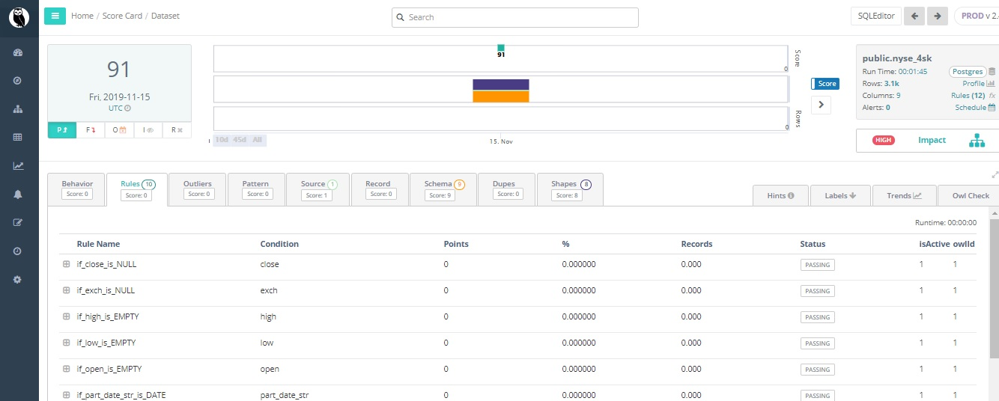
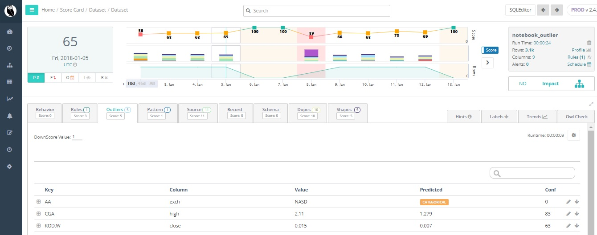
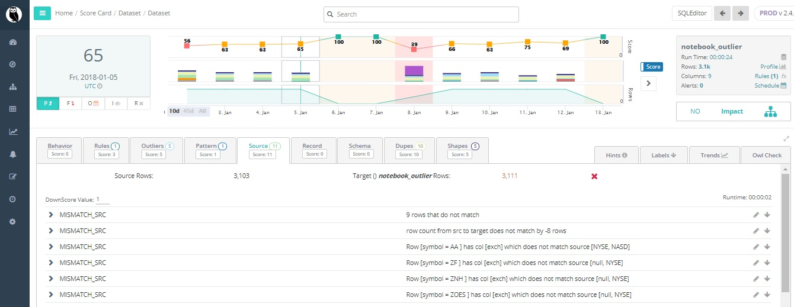
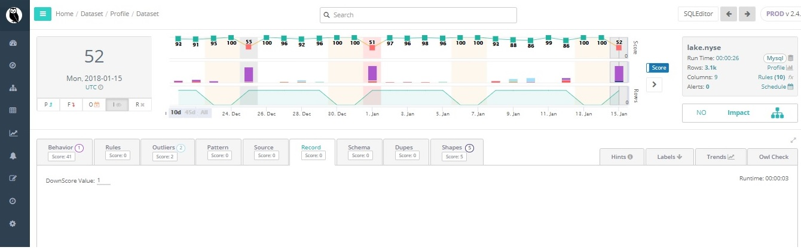
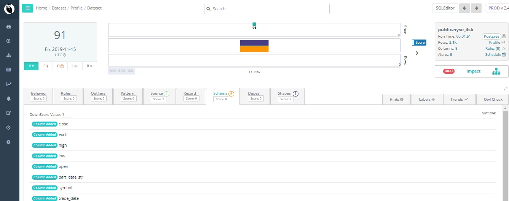
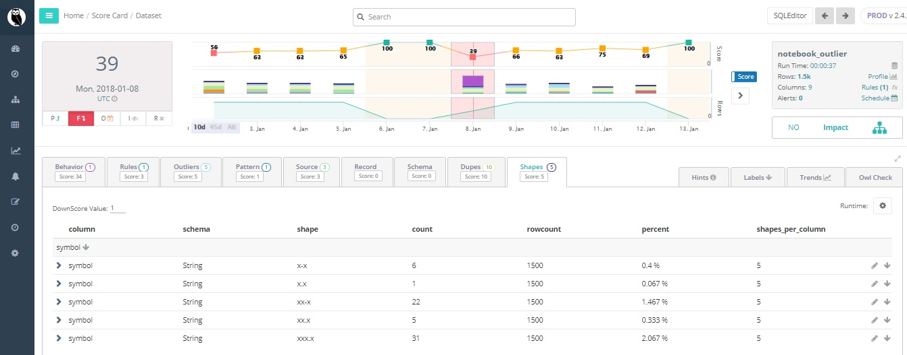
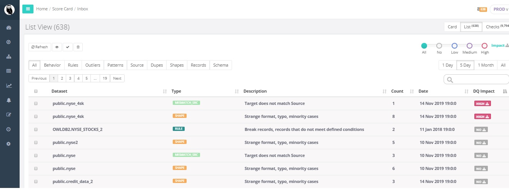

# Owl's Scorecard and 9 Dimensions of DQ

## Scorecard

Owl provides a data quality assessment that that scans 9 dimensions of a data set to assure the integrity of that data. The 9 dimensions are behavior, rules, outliers, pattern, source, record, schema, duplicates, and shapes. OwlCheck produces a data quality score from 0-100. 100 represents that there were no integrity issues found in the data set. The score numerically represents the integrity of that data. For example, the score of 100 would tell the data analyst that zero data quality issues in that data set.

Owl will scan your data with the same frequency, that you load your data - Owl scans 9 dimensions of DQ out of the box 

## **1. Behavior** 

**Imagine a column going null, automatic row count checks - does your data behave/look/feel the same way it has in the past.**

## **2. Rules**

**Assures only values compliant with your data rules are allowed within a data object.** 

## **3. Outliers**

**Data points that differ significantly from other observations.**

## **4. Pattern**

**Recognizing relevant patterns between data examples.** 

## **5. Source**

**Validating source to target accuracy.**

## **6. Record**

**Deltas for a given column.** 

## **7. Schema** 

**Columns add or dropped.**

## 8. Dupes 

**Fuzzy matching to identify entries that have been added multiple times with similar but not exact detail.**

## **9. Shapes**

**Infrequent formats.**

## List View with Impact Analysis

