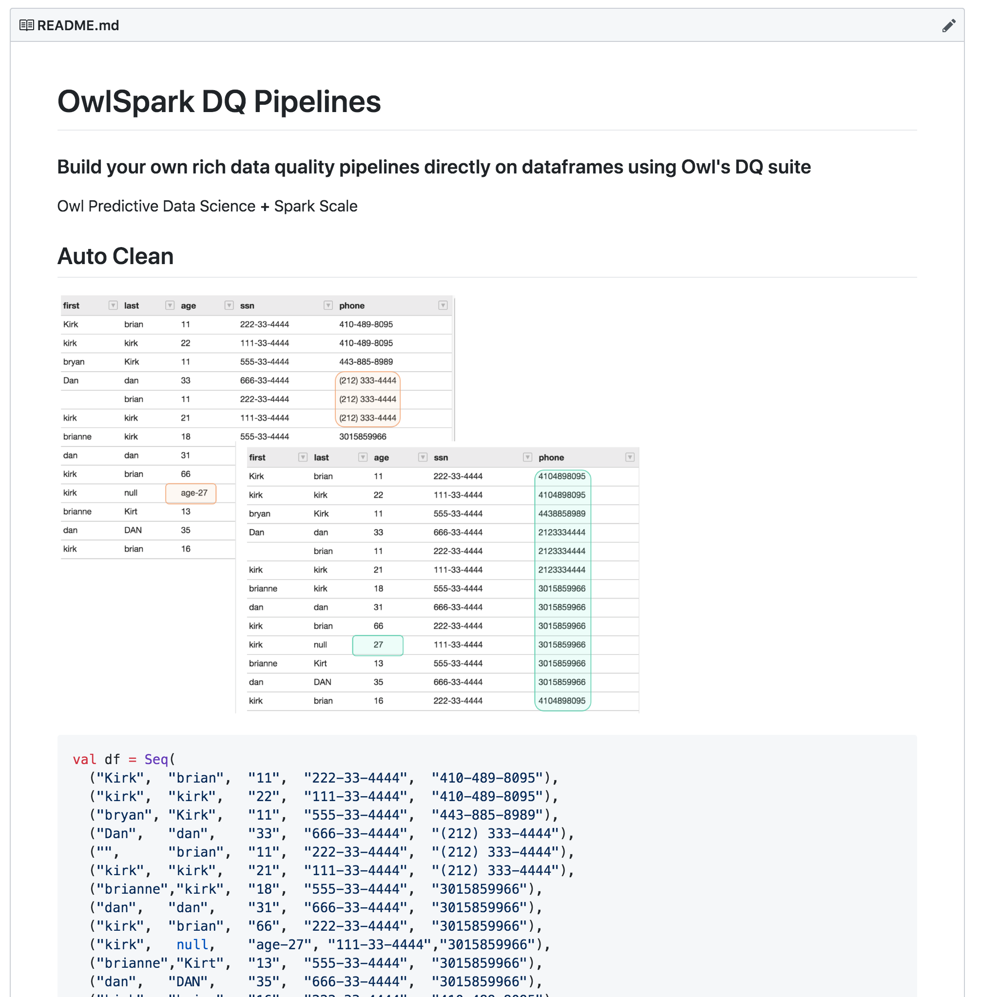

# Spark - DQ Pipeline

### Use Notebooks to build DQ Pipelines



### Real World Example

Let's assume we were provided a file named "atm\_cust\_file" and want to load it into a database table as well as scan it for all possible errors.  We want to provide a couple levels of protection. 1\) A business rule checking if _a customer joined before before the company was founded_.  2\) Check if the file 100% matches to the DataFrame or db table we've created.  3\) Check for all possible outliers or anomalies in the dataset.  Each one of these 3 issues had a different impact to the business and causes a different flow to trigger in our pipeline.     

#### Add Rule

Let's create a simple rule and assign points to the overall scoring system for later delegation. 

```scala
    val rule = new domain2.Rule
    rule.setRuleNm("customer_before_company")
    rule.setRuleValue("customer_since_date < '1956-11-01'")
    rule.setPerc(1.0)
    rule.setPoints(1)
    rule.setIsActive(1)
    rule.setUserNm("Kirk")
    rule.setDataset("ATM_CUSTOMER3")
    Util.addRule(rule=rule)
```

Now let's chain together the remaining 2 items that were part of our original requirement.  Note that Owl has 6 additional ML DQ features that we did not turn on in this case.

```scala
val owl = Util.OwlContext(df, atmCustFile, props)

// first register with catalog if not registered
owl.register(props)

// Check if dataframe matches the source file 'atm_cust_file'
val source = owl.validateSrcDF
if (source.count() > 1) {
  // create service now ticket and exit with fail based on not matching to original file
}

owl.addAdHocRule(rule)  
val ruleBreaks = owl.rulesDF
if (ruleBreaks.count() > 1) {
  if (ruleBreaks.where($"score" > 5).count > 1) {
    // create service now ticket and exit with fail based on rules
  }
}

val outliers = owl.outliersDF
if (outliers.where($"confidence" < 10).count > 3) {
  // Owl email Alert to business group for attention
  // where 3 outliers have a confidence below 10
}
```

### All Pipeline Activities in 1 Line

For brevity and convenience Owl allows a DF to be loaded in the constructor and in 1 line run all 9 dimensions of data quality "owl.owlcheck".  To adjust the DQ dimensions you simply set the properties in the props object.   

```scala
val owl = Util.OwlContext(df, atmCustFile, props)
owl.owlCheck
```

#### Example of some common property settings

```scala
val props = new Props()
props.filePath = s"${filePath}/atm_customer_${rd.replace("-","_")}.csv"
props.runId = rd
props.dateCol = "OWL_RUN_ID"
props.dataset = "ATM_CUSTOMER3"
props.del = ","
props.datasetSafety = false
props.calculateBoundaries = true
props.fileLookBack = true
props.timeBin = "DAY"

// outlier, missing records
props.dl = true
props.dlKey = "customer_id"
props.dlLb = 4

// pattern mining
props.freqPatternMiningByKey = true
props.fpgKey = "customer_id"
props.fpgLookback = 4
props.fpgDateCol = "OWL_RUN_ID"
props.fpgCols = "card_number,first_name,last_name,checking_savings"
props.fpgLowFreq = true

// validate Src
props.validateSrc = true
props.valSrcKey = "customer_id"

// fuzzy match
props.isDupe = true
props.dupeCutOff = 88
props.depth = 3
props.dupeExcludeCols = "customer_id,card_number,customer_since_date,OWL_RUN_ID"
```



