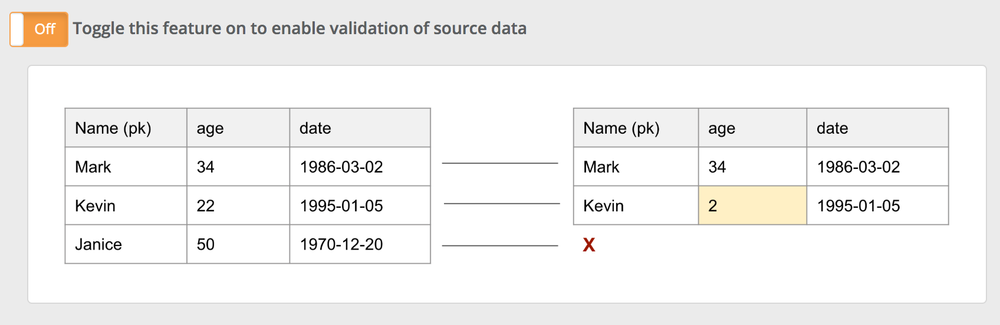

# OwlCheck Validate Source

### Reconciliation

Commonly data driven organizations have a need to ensure that 2 tables or a table and file match.  This match might be a daily reconciliation or any snapshot in time.  Owl calls this Source to Target or Left to Right matching.  It covers row differences, schema differences and all cell values. 



### Impala/Hive -&gt; DB2

Below is an example of comparing a table in DB2 to the same table in Impala.

```bash
./owlcheck \
-lib "/home/install/owl/drivers/db2" \
-cxn db2 \
-q "select * from OWLDB2.NYSE_STOCKS where TRADE_DATE = '${rd}' " \
-ds NYSE_STOCKS_VS \
-rd "2018-01-10" \
-vs \
-valsrckey SYMBOL \
-validatevalues \
-h $host/owltrunk \
-srcq "select * from nyse where TRADE_DATE = '${rd}' " \
-srccxn impala-jdbcuser \
-libsrc /home/isntall/owl/drivers/hivedrivers \
-jdbcprinc jdbcuser@CW.COM -jdbckeytab /tmp/jdbcuser.keytab \
-owluser admin \
-executorcores 4 -numexecutors 6 -executormemory 4g -drivermemory 4g -master yarn -deploymode cluster \
-sparkkeytab /home/install/owl/bin/user2.keytab \
-sparkprinc user2@CW.COM
```

### DB2 -&gt; Hive \(Native\)

Most databases only expose data through a JDBC connection but Hive offers a second path which does not require a JDBC connection.  Hive has the ability to push down its processing to the local worker nodes and read directly from disk in the case when the processing is happening locally on a cluster.  If your processing is not happening local to the cluster then you must use HiveJDBC.  Take note of the -hive flag.

```bash
./owlcheck \
-hive \
-q "select * from nyse" \
-ds hiveNativeNyse \
-rd "2019-10-01" \
-vs \
-valsrckey exch,symbol,trade_date \
-validatevalues \
-srcq "select * from OWLDB2.NYSE_STOCKS" \
-srccxn db2 -libsrc /home/install/owl/drivers/db2 \
-numexecutors 2 -executormemory 5g -drivermemory 4g -master yarn -deploymode cluster \
-sparkkeytab /home/install/owl/bin/user2.keytab -sparkprinc user2@CW.COM 
```

### MySQL -&gt; Oracle

This example compares the entire table instead of just a single day.  Notice the 3 part valsrckey EXCH,SYMBOL,TRADE\_DATE.  Adding the date field ensures our key is unique and won't create a cartesian product.  If the goal was to compare day over day with Oracle make sure to add TO\_DATE\('YYYY-MM-DD', '2019-10-01'\) to the where clause.  

```bash
./owlcheck \
-lib /home/install/owl/drivers/mysql/ \
-cxn mysql \
-q "select * from lake.nyse" \
-ds lake.nyse \
-rd 2019-10-01 \
-vs \
-valsrckey EXCH,SYMBOL,TRADE_DATE \
-validatevalues \
-sparkkeytab /home/install/owl/bin/user2.keytab \
-sparkprinc user2@CW.COM \
-srcq "select * from SYSTEM.NYSE" \
-srccxn oracle \
-libsrc /home/danielrice/owl/drivers/oracle/
-numexecutors 2 -executormemory 5g -drivermemory 4g -master yarn -deploymode cluster \
```

### File -&gt; MySQL Table

Taking a file and loading it into a staging table or final table is a common part of every ETL process.  However it is extremely common that the file values do not match or coherence into the table properly and these silent errors are usually not caught until a business user sees the data far long down stream.

```bash
./owlcheck \
-ds lake.nyse \
-rd 2019-10-01 \
-cxn "mysql" \
-q "select * from lake.nyse" \
-vs \
-valsrckey EXCH,SYMBOL,TRADE_DATE \
-validatevalues \
-srcfile "hdfs:///user/source/nyse.csv" \ 
-srcd "," \
-lib /home/install/owl/drivers/mysql/ \
-sparkkeytab /home/install/owl/bin/user2.keytab \
-sparkprinc user2@CW.COM \
-numexecutors 2 -executormemory 5g -drivermemory 4g -master yarn -deploymode cluster \
```

### File -&gt; File

Owl can compare a File to a File.  This is common in landing zones and staging areas where a file might be moved or changed and you need to know if anything changed or is incorrect.

```bash
./owlcheck \
-ds lake.nyse \
-rd 2019-10-01 \
-f "hdfs:///user/target/nyse.csv" \
-d "," \
-vs \
-valsrckey EXCH,SYMBOL,TRADE_DATE \
-validatevalues \
-srcfile "hdfs:///user/source/nyse.csv" \ 
-srcd "," \
-sparkkeytab /home/install/owl/bin/user2.keytab \
-sparkprinc user2@CW.COM \
-numexecutors 2 -executormemory 5g -drivermemory 4g -master yarn -deploymode cluster \
```

