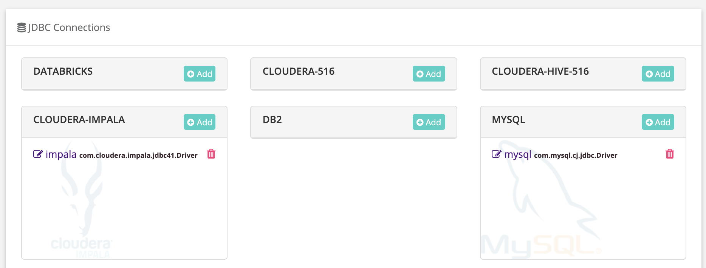
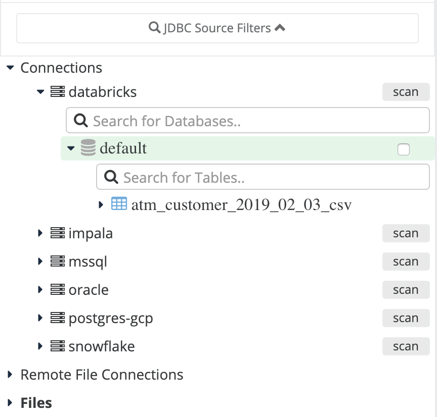

# OwlCheck Databricks

## Native Integration with Delta Lake \(Databricks\)

Out of the box OwlDQ comes with a connection template for Databricks.  To connect, simply paste in your username, password and connection URL.   

### Explore Databricks Assets and Add DQ Checks

Quickly explore DB assets that are cataloged in Delta Lake the same way you would any database.  Use OwlDQ wizard to add DQ to any DB table, file etc...

## 9 dimensions of Data Quality

Use the wizard to apply Owl's autoML and predictive DQ features across all of your assets in Delta Lake.  Click Scan button to put ever table in Delta Lake under DQ management in 1 click.  Owl can create a data quality program on all Delta Lake assets in a matter of hours.  With traditional technologies this task used to require domain experts, rule writers and identification of critical elements. 

