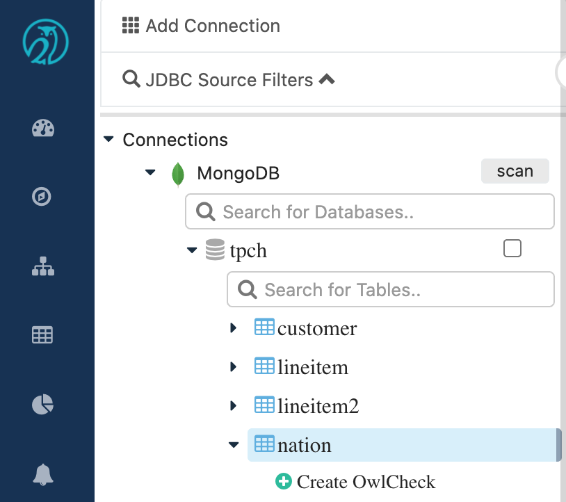
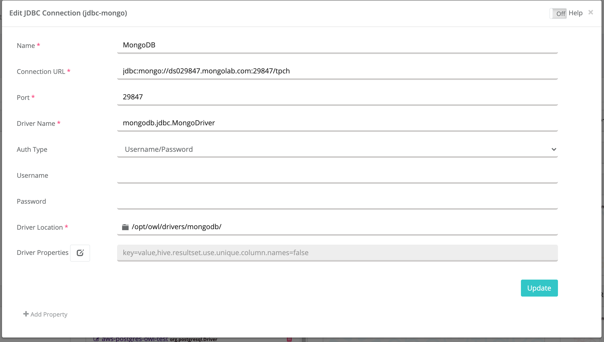
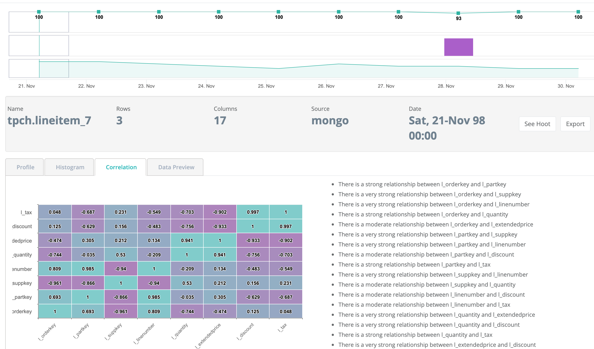

# OwlCheck MongoDB

## Browse MongoDB like any other relational database

Using Owl's file tree explorer browse Mongo "collections" like "tables".  Then use the wizard to create standard DQ scans. 



### CMD Line

Copy paste-able cmdline example for simple spark submit job.

```bash
-lib "/opt/owl/drivers/mongodb/" 
-h localhost:5432/postgres 
-master local[*] 
-ds tpch.lineitem_7 
-br 10 -deploymode client 
-q "select * from tpch.lineitem where l_shipdate between '${rd} 00:00:00.000+0000' 
and '${rdEnd} 00:00:00.000+0000' " 
-bhlb 10 -rd "1998-12-01" 
-driver "mongodb.jdbc.MongoDriver" 
-loglevel INFO -cxn MongoDB -rdEnd "1998-12-02"
```

## Drivers and Config

In order to make this possible OwlDQ requires 2 drivers, MongoDB driver and UnityJDBC Driver.  Out of the box OwlDQ comes preconfigured with these drivers.  You simply open the MongoDB connection template and paste in your JDBC URL.

```text
driverClass: mongodb.jdbc.MongoDriver

path: /opt/owl/drivers/mongodb/
    +-- mongoJdbc.jar
    +-- unityJDBC.jar
```

### Simply paste in JDBC Info





