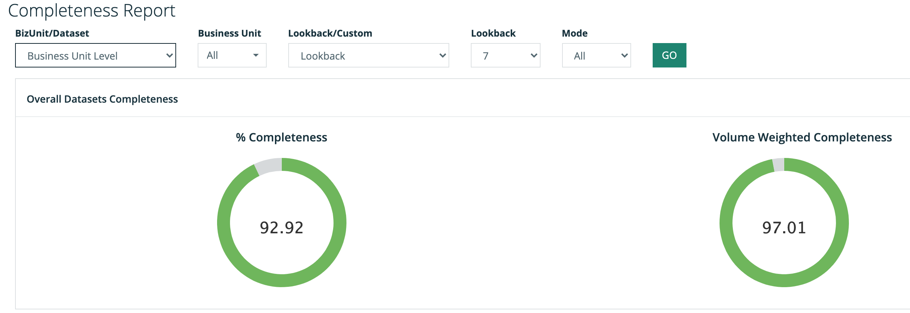
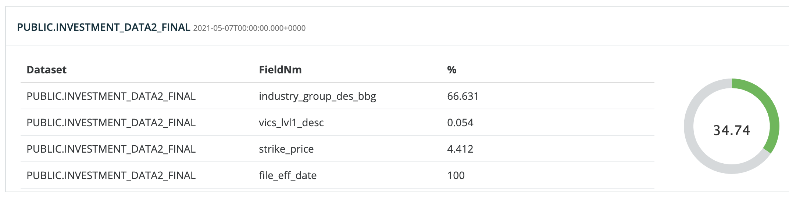
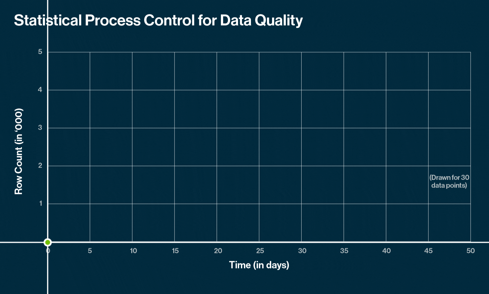

# Completeness Report

Completeness commonly means what percentage of your data is filled in, as in not `EMPTY` or `NULL`.  The confusion often comes when you consider the context of completeness.  Completeness of a column?  Completeness of a dataset \(file or table\)? Completeness of a collection of tables or business unit?  And even worse... completeness over time.

Fortunately the Collibra DQ Completeness Report covers all of these dimensions, allowing the user to generate a report that answers almost any completeness question.  We have also found that volume weighted completeness is arguably a better metric than average completeness in a rollup scenario.

### Report Builder

The "all" view shows completeness of the entire DQ program.  Really interesting to see that across hundreds of datasets and thousands of total columns or data assets we are 92% complete.  The more accurate measurement is likely the 97% due to the fact that it represents the volume of data as well.  

When looking at Completeness over time you may need to differentiate between the time when the DQ job ran \(update time\) or the date/time the data represents \(run date\).  For example I load stock data today but the data I loaded was for last week. 

### Column Completeness vs Dataset Completeness

Above you can see the dataset is 34.7% complete this is made up of columns ranging from 0% to 100% complete.  This view makes it easy to see which columns are the least complete and likely the biggest DQ concern.

### Why is Completeness a concern for DQ?

Data completeness is a large concern because it means the data is missing all together.  Data can be inaccurate, invalid, of the wrong type but missing leaves you without any data.  The challenge is that sometimes data values can be missing for good reasons, this leaves the challenge up to the business user to understand the context of whether missing data is bad for business or acceptable.  Please read about Collibra DQ [Behaviors](../dq-visuals/behaviors.md) detection including `NULL` and `EMPTY` detection for a more modern approach to completeness management.  In this approach we will use the data itself to create baselines and profiles to understand which completeness issues actually matter and should be actioned. 

### Why Behavioral Analytics for Completeness is Better?

In many academic settings completeness is defined for cases where you expect the data to be complete.  However in the real world you have too much data and never enough time to document what and when data should be complete.  It is vastly more efficient to use Collibra DQ `Replay` and `Profile` features to generate _statistical process control_ around completeness.  This will alert you to a change in slope, or in other words a drastic change in completeness, which tends to be the exact DQ events you care the most about.

