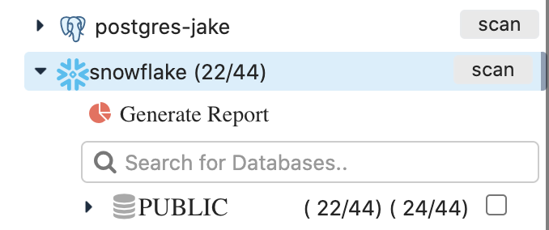

# Coverage Report

## How to Generate a Data Quality Coverage Report

In the explorer view where you see the file tree explorer for each database you can click the pie chart \[coverage report\].  This will show all the datasets that have been cataloged and that have DQ jobs running.  The time-series bars shows the run level information aggregated by month, while the donut chart shows the percent coverage of the entire database or schema. 



### File tree explorer Generate Report

22 out of 44 tables in public schema have been DQ jobs running on them.  Likely have profiles and auto rules for validation.  24 out of 44 have been cataloged, which means they are registered and have metadata.

