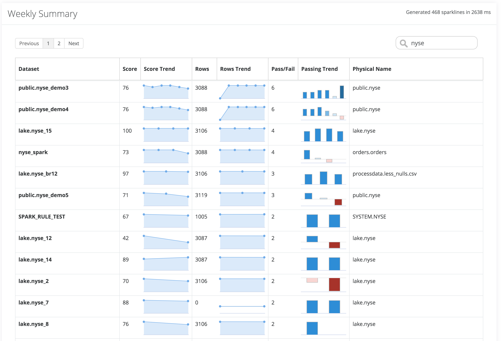

# Owl Summary Reports

### Owl Weekly Rollup Reports

When operating a large data lake or several large data environments it can be helpful to be able to report across different dimensions at an executive summary level.  You may wish to know the health or coverage per line of business, department or tenant or per database.  A single snapshot in time usually doesn't tell the whole story.  Owl automatically aggregates a simple series of the high level trends for each dataset.  This allows a business user to see the DQ scores and trends as well as row counts and passing runs at a glance. These reports can be exported by clicking the file type you prefer in the header.

